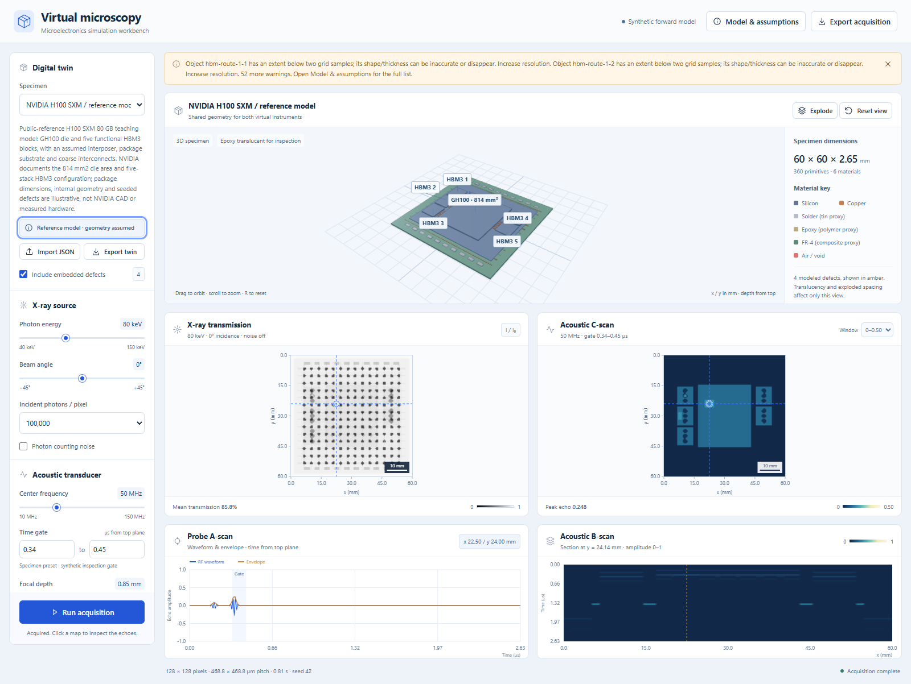
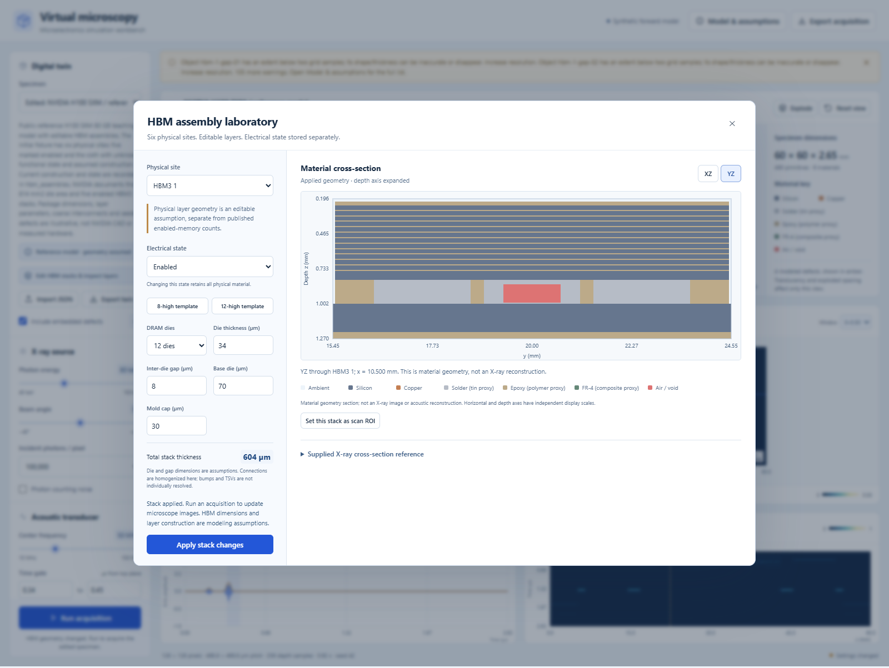
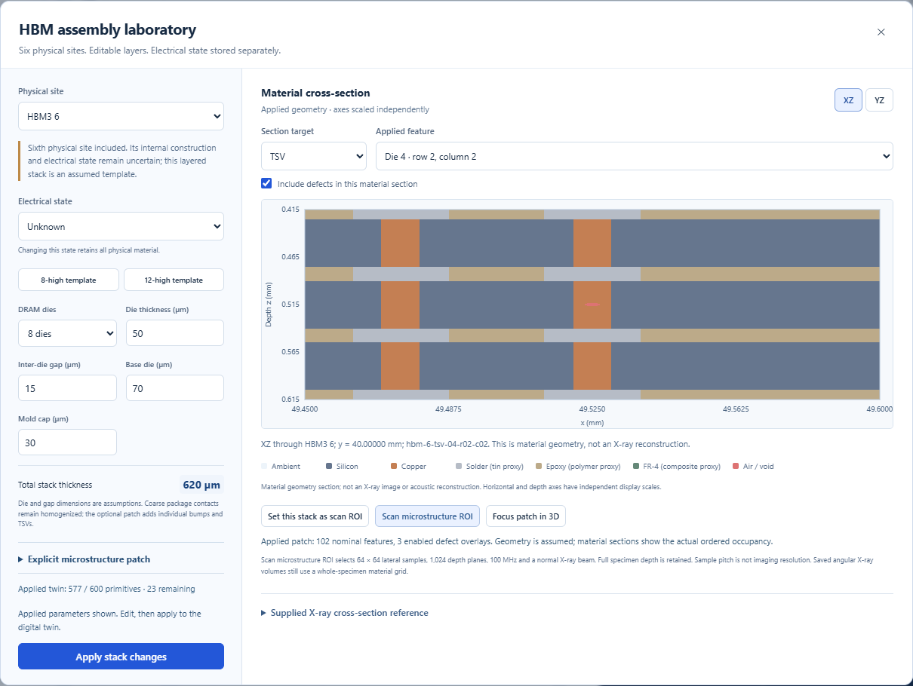
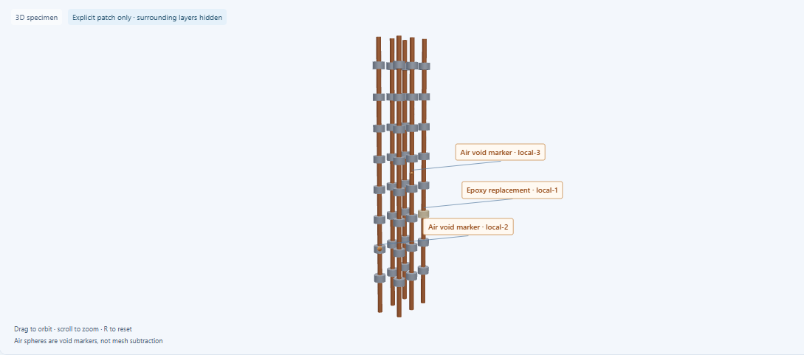
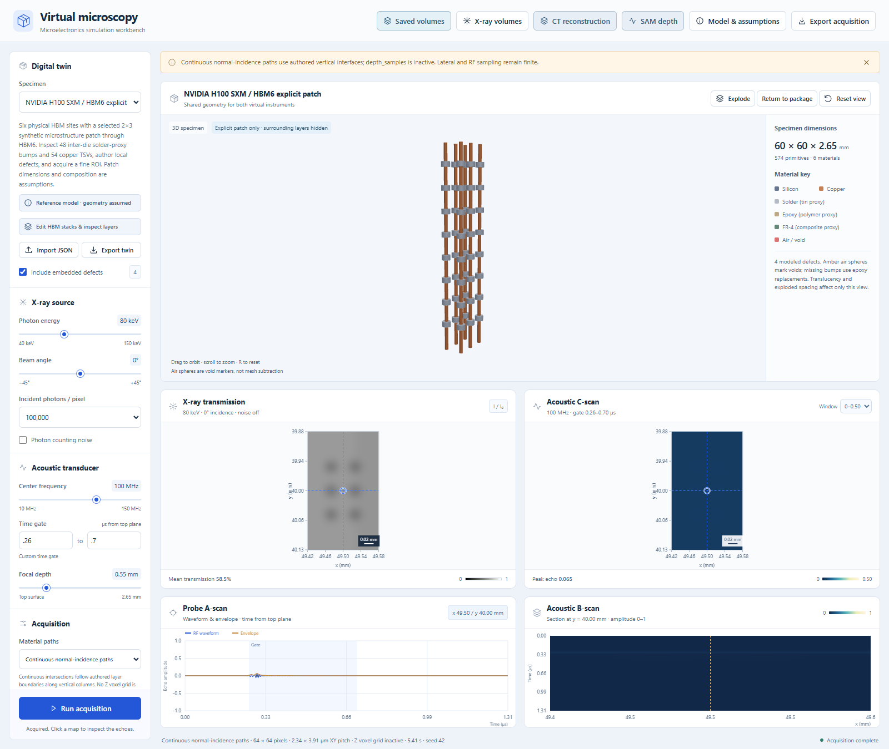
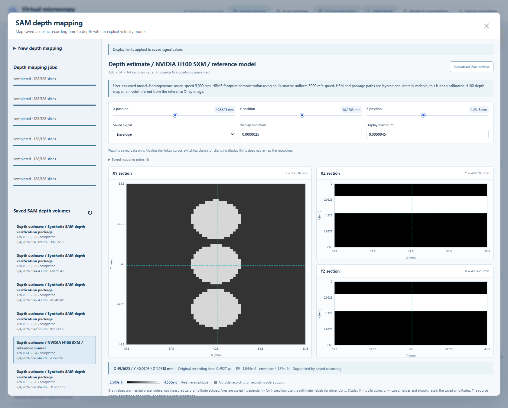
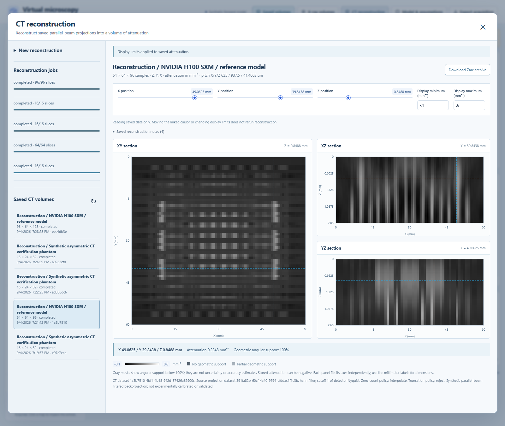
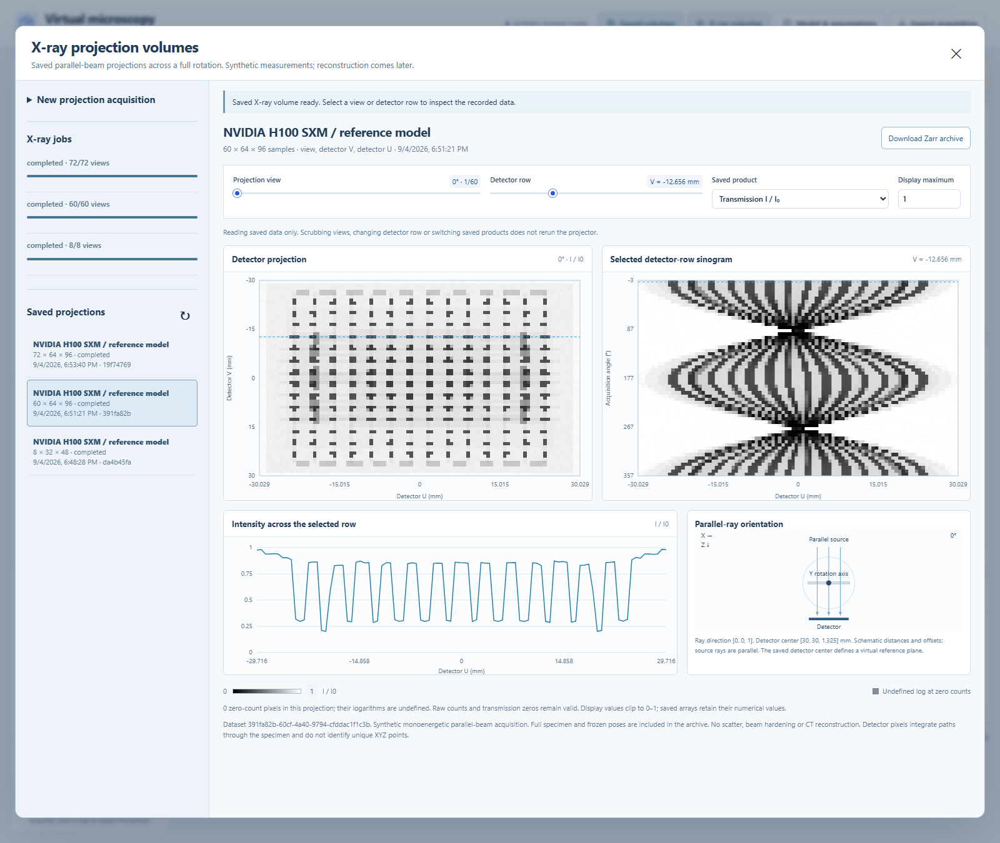
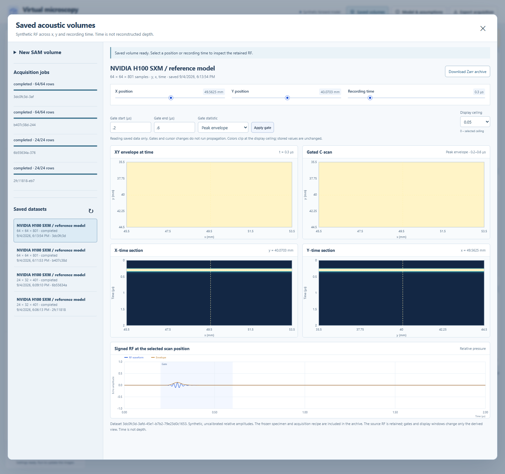

# Virtual microscopy workbench

[](https://github.com/patrickjcraig/virtual-microscopy-workbench/actions/workflows/ci.yml)

A local research prototype that loads a material-aware digital twin of a microelectronic package and simulates X-ray radiography and scanning acoustic microscopy from the same geometry. A browser workbench combines a 3D specimen, acquisition controls, quantitative images, pulse-echo inspection, saved acoustic RF volumes, full-angle X-ray projection stacks, reconstructed spatial attenuation, and SAM depth estimates.

**Evidence status:** synthetic, reduced-order forward models. This version provides two imaging physics models sharing one specimen. It has no experimental calibration and does not claim a coupled elastic/electromagnetic solver or measured instrument accuracy.



## Start on Windows

Prerequisites: [uv](https://docs.astral.sh/uv/getting-started/installation/) and Node.js 24 with npm. Python and frontend dependencies are pinned in `uv.lock` and `web/package-lock.json`.

```powershell
git clone https://github.com/patrickjcraig/virtual-microscopy-workbench.git
cd virtual-microscopy-workbench
.\launch.ps1
```

Open **http://127.0.0.1:8765**. The launcher installs the locked Python environment, builds the frontend on first run, and serves the application on loopback. Keep its terminal running; Ctrl+C stops the server. Use `-NoBrowser` to suppress opening the default browser or `-Port 8766` to select a different port. No external credentials are required; once dependencies are installed, the app and simulators run locally.

The original Windows workspace is `E:\git\Dissertation`; run `launch.ps1` there when using that existing checkout.

On Linux/macOS, run `uv sync --locked`, then `npm ci` and `npm run build` from `web`. Return to the repository root and run `uv run uvicorn virtual_microscopy.server:app --host 127.0.0.1 --port 8765`.

To rebuild after frontend edits:

```powershell
cd web
npm.cmd ci
npm.cmd run build
cd ..
```

Restart the Python server after rebuilding. For frontend development, run the Python server on port 8765 and `npm.cmd run dev` from `web`; Vite proxies the local API.

## First inspection

1. Load **Flip-chip BGA / 64 joints**. The built-in twin has a silicon die, copper traces and plane, FR-4 substrate, and 64 solder joints. All geometry is synthetic.
2. Run the acquisition. Compare the X-ray transmission projection with the acoustic gate image. The seeded solder voids and die-attach delamination are known truth labels, not automatically diagnosed defects.
3. Click inside a map to move the acoustic probe, and inspect its signed RF A-scan and amplitude envelope. The B-scan shows time against x at the indicated y. Gate times are relative to the specimen top plane, excluding water standoff.
4. Adjust X-ray photon energy, projection angle, or photon count; adjust acoustic frequency, focus, and gate. Re-run to acquire the new settings.
5. Disable seeded defects and run again to compare the intact geometry. Export a run to preserve quantitative data, its actual acquisition settings, specimen snapshot, seed, input hash, timestamp, and model version.

At nonzero X-ray tilt, detector position is not a unique physical x/y location. The common map extent is a coordinate convention, not proof of spatial co-registration or registration accuracy.

## Import a digital twin

Use the workbench JSON import and start from [the BGA example](examples/flip-chip-bga.json), [the power-die example](examples/power-die.json), or [the H100 reference model](examples/nvidia-h100-sxm.json). The input is a geometric, material-aware twin; it does not simulate circuit electrical behavior.

```json
{
  "schema_version": 1,
  "name": "Silicon coupon",
  "description": "Synthetic 4 mm coupon",
  "size_mm": [4, 4, 1],
  "objects": [
    {
      "id": "die",
      "name": "Silicon die",
      "shape": "box",
      "material": "silicon",
      "center_mm": [2, 2, 0.5],
      "size_mm": [4, 4, 1],
      "role": "structure"
    }
  ]
}
```

- Dimensions and object centers are **millimetres**. The origin is the top-left specimen corner at the top plane; z increases into the specimen.
- Shapes are axis-aligned boxes, spheres, and z-axis cylinders. `size_mm` contains full extents, including diameters for spheres/cylinders. Later objects replace earlier objects where they overlap.
- Built-in materials are `silicon`, `copper`, `solder`, `epoxy`, `fr4`, and `air`. Air objects represent internal cavities. Unoccupied geometry is air for X-ray and water for SAM.
- `role: "defect"` allows a geometry feature to be switched off without changing the original twin.
- The workbench accepts up to 600 primitives in a specimen up to 100 × 100 × 6 mm. Inputs are validated before simulation. Increasing the physical extent does not increase the raster resolution; thin features may be undersampled. Consult each run's warnings.
- Optional `reference` metadata carries source-linked published facts and explicit geometry assumptions. Optional `recommended_settings` provides a validated initial acquisition preset, and primitive `display_label` adds a 3D label. These fields survive import/export. Older specimens remain compatible.
- Optional `hbm_assemblies` describes editable layered HBM stacks. Their compiled material primitives are validated together with the parameters, including contiguous assembly ordering, so a metadata edit cannot silently change material precedence. Optional `image_reference` preserves image identity and scale provenance. The original supplied image stays local.
- Native STEP, STL, Gerber, ODB++, and proprietary digital-twin files require a future importer that preserves material and layer semantics. They are **not** accepted directly in this version.

The machine-readable schema is available at `/api/twin-schema`; interactive API documentation is at `/docs`. See [CONTRACT.md](CONTRACT.md) for API fields and array axis conventions.

## NVIDIA H100 reference specimen

Select **NVIDIA H100 SXM / reference model**, or open `http://127.0.0.1:8765/?specimen=nvidia-h100-sxm`. Version 0.2 includes six physical HBM sites around GH100, with five enabled and the sixth's functional state unknown in the default fixture. Every default stack contains a base die, eight DRAM dies, eight epoxy interfaces and a mold cap. The interposer, substrate, contacts and four synthetic defects remain assumed geometry. The app exposes primary references and construction assumptions in **Specimen references**.

NVIDIA documents the **814 mm² GH100 die** and the **80 GB / five-stack HBM3 SXM configuration** in its [Hopper architecture article](https://developer.nvidia.com/blog/nvidia-hopper-architecture-in-depth/). The chosen **60 × 60 × 2.65 mm envelope**, die aspect ratio/thickness, layer stack, memory placement and interconnect dimensions are modeling assumptions. This is a package-level teaching specimen based on public references; it is not vendor CAD, a full SXM board, an electrical/performance emulator, or a transistor-resolved twin.

The initial acquisition uses 80 keV X-rays and a 50 MHz acoustic probe with a 0.34–0.45 µs gate. Read [H100_MODEL.md](docs/H100_MODEL.md) for construction details and [H100_REVIEW.md](docs/H100_REVIEW.md) for the independent checks. NVIDIA's product specifications do not validate the assumed materials or simulated microscopy output.

Open the **HBM assembly laboratory** to select any of the six sites, switch between generic 8-high and 12-high templates, edit die/gap/base/cap thicknesses and set electrical state. Electrical state does not remove material. Applied geometry is visible in XZ/YZ material sections; the previous microscope acquisition remains labeled stale until you run again. Material sections are geometry views, not reconstructed images.



Use **Set this stack as scan ROI** to scan its footprint with global coordinates and the complete specimen depth. When depth sampling was automatic, stack selection uses 1,024 material planes; the depth count can also be controlled independently from lateral sampling. Neighboring material is sampled in a numerical halo for detector/acoustic blur. ROI X-ray scans currently require 0° incidence; full-specimen scans retain the existing tilt control.

**New in 0.7: explicit HBM microstructure.** Choose **NVIDIA H100 SXM / HBM6
explicit patch**, or enable a patch in the HBM editor. Its 2×3 synthetic lattice
adds 48 inter-die solder-proxy bumps and 54 copper TSVs while retaining all six
physical sites. Edit pitch, diameters and local offsets; add epoxy-filled missing
bumps or contained air voids. Feature-centered XZ/YZ sections show actual material
replacement, and **Focus patch** provides a close 3D view. Scan the selected patch
using its fine global ROI with full package depth and response context.

The default patch is 574 primitives, leaving 26 under the existing 600-object
limit. Its 0.125 × 0.175 mm ROI at 64 × 64 × 1,024 has approximately
1.95 / 2.73 / 2.59 µm sampling; these are not resolution or calibrated dimensions.
Saved SAM preflight reports feature sampling and conservatively counts intersecting
material columns. See [HBM_MICROSTRUCTURE.md](docs/HBM_MICROSTRUCTURE.md) for
controls, defect semantics, numerical checks and current limits.





The supplied reference has a provisional user estimate of approximately 4.6 µm/pixel, with unconfirmed instrument calibration and resizing history. The app only shows the local image when its SHA-256 matches the imported twin's reference. Clones without that image retain all editing and simulation features.

**New in 0.8: continuous material paths.** Main previews and saved SAM now offer
an explicit continuous-column alternative to voxel-center paths. It integrates
the authored vertical material intervals without a Z voxel grid, preserving full
specimen depth, lateral response context, signed RF and frozen provenance. The
Z-sample value stays in the recipe but is visibly inactive in this mode.
Continuous previews require 0° X-ray incidence; saved full-angle X-ray projections
retain their existing projector. The HBM editor offers an explicit larger preview
ROI when the compact patch exceeds resource limits. See
[COLUMN_PATHS.md](docs/COLUMN_PATHS.md) for controls, recording examples and limits.



## Numerical exports and headless execution

**SAM depth estimates (0.6 onward).** Open **SAM depth** and select a completed
acoustic recording. Set a homogeneous speed or an explicit layer table, choose
the surface-time reference, and map the saved signed RF and analytic envelope to
a spatial depth grid. X/Y sampling stays identical to the source. The selected
velocity model and its evidence label remain visible; an assumed model is not
an experimentally calibrated depth reconstruction.

Inspect linked XY/XZ/YZ sections with original-time readouts, switch RF/envelope
display, and export a separate `[z,y,x]` dataset with validity masks and frozen
source provenance. Unsupported times and depths are masked. Raw RF is retained,
and mapping jobs support cancellation/resume. See [SAM depth](docs/SAM_DEPTH.md)
for controls, equations, units and model limits.



**Spatial CT reconstruction (0.5 onward).** Open **CT reconstruction**, select a
completed saved X-ray acquisition, and reconstruct an attenuation volume with
independent X/Y/Z counts and bounds. Choose Hann or Ram-Lak filtering, frequency
cutoff, and explicit policies for invalid logarithms and detector truncation.
The CPU baseline accepts uniform 180° or 360° parallel-beam acquisitions with at
least 16 views. Its inversion uses saved measurements and poses, without using
the twin's material labels to populate the reconstruction.

Inspect linked XY/XZ/YZ slices, click or use arrow keys to move a physical cursor,
adjust the display window including negative values, and export attenuation in
mm⁻¹ with geometric coverage, coordinates and frozen source provenance. These
arrays have axes `[z,y,x]`. Reconstruction jobs support queueing, cancellation,
resume and reopening. See [Reconstruction](docs/RECONSTRUCTION.md) for the
algorithm, resource limits, unsupported-data masks and numerical validation.



**Saved X-ray projections (0.4 onward).** Open **X-ray volumes** to acquire a full
rotation or a chosen angular span with the CPU parallel-beam projector, including
90° side views. Control view count, energy, incident photons, counting noise,
detector field/offsets/blur and raster, rotation center, and independent material
grid counts. The complete sampled specimen contributes to every ray. Inspect
saved photon counts, transmission and negative-log transmission using a view
scrubber, sinogram, row profile and explicit geometry diagram. Queue, cancel,
resume, reopen and export through the shared dataset system.

These arrays have axes `[view,v,u]`. Detector pixels and material voxels have
independent sampling; neither pitch establishes physical resolution. Every saved
view retains its angle, unit ray direction, detector center and basis vectors.
See [X-ray volumes](docs/XRAY_VOLUMES.md) for geometry, controls, storage, Python
access and resource limits. Projection stacks and derived xyz CT reconstructions
remain separate datasets, preserving the original counts and logarithms.



**Saved SAM volumes (0.3 onward).** Open **Saved volumes** to record signed RF at
every raster position, with independent record start/duration, sample rate, pulse
bandwidth, water standoff and rectangular raster controls. A local background
worker saves chunked Zarr arrays with progress, cancellation and resume. Reopen a
completed dataset to inspect XY/X–time/Y–time views and change gates without
rerunning propagation. Download the full data and frozen provenance as a Zarr ZIP.

These datasets have axes `[y,x,time]`; the time axis is not reconstructed depth.
The original microscope preview remains available alongside the saved-data
workflows. The separate SAM depth workspace maps these saved signals through a
declared homogeneous or layered velocity model.
See [Saved volumes](docs/SAVED_VOLUMES.md) for controls, storage, Python access and
the current numerical/resource limits.



The UI exports JSON containing numerical arrays and provenance. Python users can run the same engine without the browser:

```powershell
uv run python -m tools.run_simulation examples/flip-chip-bga.json artifacts/my-first-run --resolution 128 --no-noise
```

The command creates `simulation.json` and `arrays.npz` in a new output directory and refuses to overwrite an existing directory. NPZ arrays contain transmission, acoustic amplitude, time, RF/envelope, and B-scan data; units and extents are in the JSON snapshot.

Headless runs use a twin's `recommended_settings` when supplied; explicit command-line options override those values. For the H100 preset:

```powershell
uv run python -m tools.run_simulation examples/nvidia-h100-sxm.json artifacts/h100-run
```

To scan the sixth HBM footprint at 1,024 depth samples:

```powershell
uv run python -m tools.run_simulation examples/nvidia-h100-sxm.json artifacts/hbm6-run --hbm-roi hbm-6 --no-noise
```

For a custom region, use `--roi X0 Y0 X1 Y1` in global millimetres and optionally `--depth-samples 128|256|512|1024`. ROI runs use normal incidence and center the probe in the selected field. Exported extents and coordinates remain global.

## Physics and verification

See [docs/PHYSICS.md](docs/PHYSICS.md) for equations, sources, material assumptions, numerical sampling, and model limits. X-ray attenuation draws on NIST tables; polymers, solder alloy behavior, and acoustic material properties include documented approximations. Browser display windowing is separate from exported physical values.

```powershell
uv run pytest -q
```

Tests cover analytical forward-model cases and public API validation/reproducibility. Passing tests establish numerical behavior in those cases; measured phantom experiments, convergence studies, transducer characterization, and cross-modal calibration remain necessary before scientific accuracy claims.

The executed checks and their scope are recorded in [docs/VERIFICATION.md](docs/VERIFICATION.md). Native browser checks are also available: with the server running, set `MICROSCOPY_CHROME_PATH` to a local Chrome/Chromium executable and run `npm.cmd run verify:exports`, `npm.cmd run verify:h100`, `npm.cmd run verify:hbm`, `npm.cmd run verify:volumes`, `npm.cmd run verify:volume-jobs`, `npm.cmd run verify:xray` or `npm.cmd run verify:xray-jobs` from `web`. They verify downloads, provenance, HBM editing/regions, saved-volume acquisition and inspection, reopening and cancellation/resume. Volume checks create synthetic datasets in the local catalog.

Run `npm.cmd run verify:reconstruction` for the saved-source CT workflow and
`npm.cmd run verify:reconstruction-jobs` for native cancellation/resume. These
checks create synthetic datasets and preserve their source acquisitions.

Run `npm.cmd run verify:depth` for the saved-source SAM depth workflow and
`npm.cmd run verify:depth-jobs` for cancellation after committed slices and
resumption of the same dataset. Run browser volume checks sequentially: the
shared worker intentionally defers previews while a saved job is active.

Run `npm.cmd run verify:microstructure` for patch editing, defect sections,
close viewing, fine ROI preview and saved acoustic acquisition. Set
`MICROSCOPY_URL` when using a server port other than 8765.

Run `npm.cmd run verify:continuous-paths` for explicit method selection, inactive
Z settings, saved continuous RF, historical data, and the larger HBM preview ROI.

The local bump/TSV patch and continuous material paths are delivered. The next
work adds saved-SAM recipes, bounded cases and repeatable comparisons before
richer propagation models.
GPU cone CT and iterative laminography remain separate future extensions. See
[EXPANSION_PLAN.md](docs/EXPANSION_PLAN.md) for the sequence and acceptance gates.
Version 0.8 retains raw SAM RF and X-ray projections alongside derived CT and
SAM depth volumes.

The implementation is separated into `virtual_microscopy/physics.py` and `materials.py`, strict schemas and local API, `web/` UI, reproducible example geometry, and tests. This leaves room for higher-fidelity solvers and CAD/voxel import while keeping the current demo runnable.

GitHub Actions runs the numerical/API tests and production frontend build on Windows and Linux. Generated environments, caches, downloads, local acquisition data and test artifacts are excluded from Git.
