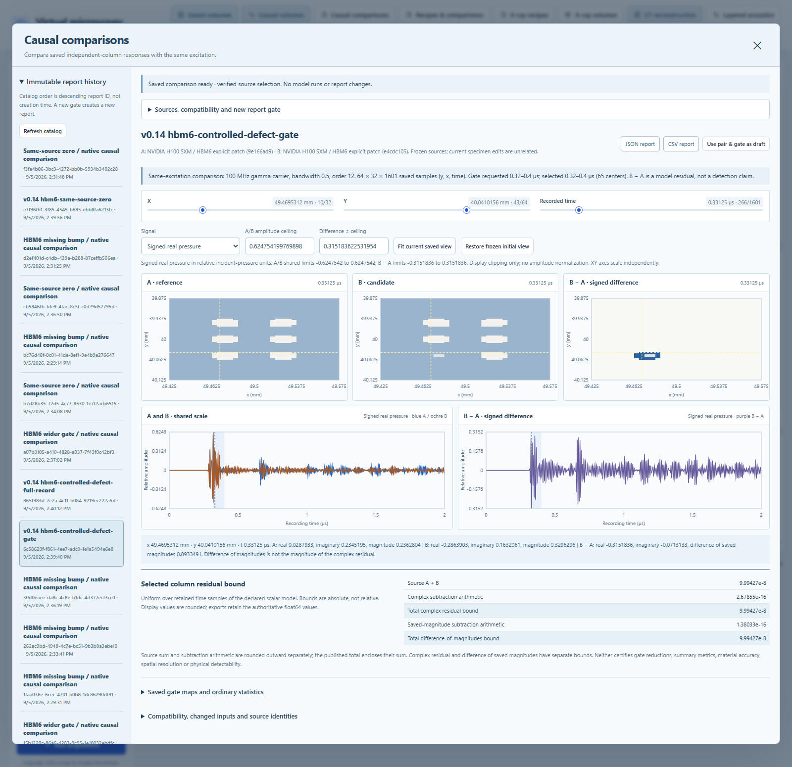

# Comparing saved causal volumes

Version 0.14 adds immutable comparisons of two `sam_causal_rf_volume` recordings.
The inputs are the original saved float64 real pressure, imaginary pressure and
complex magnitude. The comparison retains their coordinates and complete source
manifests. It never constructs a twin or runs a forward solver.

## Workflow

1. Open **Causal comparisons**, or start from a saved causal volume's comparison
   action. Choose reference A and candidate B. The reference is a chosen baseline,
   not ground truth. Existing primary SAM/X-ray comparisons remain separate.
2. Set a recording-time gate inside both saved records. For the delivered HBM
   intact/missing-bump pair, 0.32–0.4 µs includes a useful modeled return. Gates
   include the actual saved centers at their boundaries.
3. Create a report. Unsupported or incompatible sources are rejected without
   changing the request or creating an acquisition. The initial maps, traces,
   metrics, source snapshots and comparison bounds are saved together.
4. Inspect shared-scale A/B maps and a symmetric signed difference map. Select
   real pressure, quadrature or the separately saved magnitude. Linked X/Y/time
   cursors show the same physical location in both recordings.
5. Inspect the source-bound sum, subtraction allowance and combined bound for
   the selected column. Summary metrics and gate maps have their own ordinary
   diagnostic labels. A changed gate creates another report.
6. Export JSON or lossless CSV, or reopen the saved report. Its initial view and
   exports remain available without the original datasets. New cursor reads
   require both sources to match their frozen report snapshots. Source Zarr ZIPs
   remain available through the original acquisition export routes.



## Compatibility and attribution

Actual X/Y/time coordinate vectors must have identical canonical float64 bytes,
including their lengths. One-ULP coordinate changes are rejected. Extents, axes,
units and the declared excitation, time reference, normalization, observation and
certificate contracts must match supported versions. No peak alignment,
interpolation, phase fitting or amplitude normalization is performed.

The initial policy is `same_excitation_v1`: matching carrier, bandwidth, gamma
order, standoff and exterior media, with independent unfocused lossless columns.
Different tolerances or arithmetic precision are allowed and disclosed because
they affect numerical acceptance, not the excitation. Intentional twin, defect
or represented finite-layer property differences are retained in the source
snapshots. This comparison does not add acquisition material-law controls.

The report separates acquisition settings, twin hashes, geometry paths, resolved
numerical column changes, material properties and implementation identities.
Class numbers are local to each source; comparison uses resolved numerical stacks
to identify changed columns. A changed twin hash may reflect names or metadata.
Multiple changed inputs do not establish a single physical cause.

## Residuals and subtraction bounds

For each sample, let the saved complex pressures be `A_r+i A_i` and `B_r+i B_i`.
The signed residual components are `fl(B_r-A_r)` and `fl(B_i-A_i)`. Saved envelope
values are compared independently as `fl(B_envelope-A_envelope)`; that quantity
is a difference of magnitudes, not the magnitude of the complex residual.

Each source supplies a full-record column bound, `eps_A` or `eps_B`, for its
complex pressure and magnitude. Their sum alone does not cover rounding in the
returned subtraction. For each real/imaginary component `j`, the implemented
allowance is:

```
u = 2^-53, eta = 2^-1074
M_Aj = max_t(abs(A_j)), M_Bj = max_t(abs(B_j))
rho_j = u * (M_Aj + M_Bj) + eta
```

This uses the error bound for one correctly rounded binary64 subtraction with
gradual underflow. Gradual underflow retains representable small results rather
than flushing them to zero. See the [Oracle numerical computation guide](https://docs.oracle.com/cd/E77782_01/html/E77791/z4000ac020351.html).
NumPy's `eps` is `2^-52`; unit roundoff here is half of that value. The smallest
subnormal is distinct from the smallest normal value. [NumPy `finfo`](https://numpy.org/doc/stable/reference/generated/numpy.finfo.html)

All bound arithmetic uses exact rational values of the represented inputs. With
`upward(q)` denoting a finite double at least the exact nonnegative rational `q`,
the published complex maps are:

```
source_sum        = upward(exact(eps_A) + exact(eps_B))
complex_arithmetic = upward(rho_real + rho_imaginary)
complex_total    = upward(exact(source_sum) + exact(complex_arithmetic))
```

The L1 sum of component allowances conservatively bounds their complex modulus.
An analogous single-component allowance and total are saved for envelope
subtraction. Totals enclose the exact sum of their already-published components.
The conversion checks the encoded double against the exact rational and advances
with `nextafter` only when required. [Python `math.nextafter`](https://docs.python.org/3/library/math.html#math.nextafter)

The initial arithmetic contract supports CPython/NumPy 2 on little-endian
Windows/Linux x86-64. Actual contiguous and strided subtraction paths are probed
at numerical-operation entry and exit for ties, signed zeros, subnormals and
double-rounding counterexamples. Unsupported behavior or nonfinite results reject
the calculation; the workbench does not change the floating environment. These
enclosures assume that supported arithmetic remains in force during processing.

## Ordinary diagnostics

Full-record and gated metrics include signed component bias, MAE, RMS, reference
L2 and relative L2, complex residual RMS and a deterministic first maximum
locator. A zero reference norm yields a null relative result with a reason.
Signed/absolute sums use bounded exact accumulators; norms use scaled reductions
to avoid unnecessary overflow. Unrepresentable results reject publication.

Gate maps store the peak saved magnitude and RMS real pressure for each source.
Their difference is `statistic(B)-statistic(A)`, not a statistic of `B-A`.
These metrics, gate reductions, displayed complex magnitudes and threshold counts
do not receive new numerical certificates. No detection-rate, measured-accuracy
or physical-resolution claim follows from them. Time remains recording time;
repeated returns do not identify unique depths.

## Integrity, resources and historical use

Every source is checked using the existing causal store before decoding. Row
checksums and class waveform certificates are checked again while reducing, and
both manifest snapshots are checked before the result returns. All operations
read one source row at a time; they retain no whole-volume copies.

Source manifests retain their 8 MiB serialized / 32 MiB expanded limits. Reports
are bounded at 64 MiB serialized / 192 MiB expanded, with a separate conservative
512 MiB owned-workspace ceiling across source verification, reduction and
encoding. These caps are simultaneous admission conditions, not an entitlement
to allocate every maximum together. They are not process-RSS measurements.

Publication uses a new exclusive report filename and an fsynced temporary file.
The report includes request/source/report hashes and the comparison, reader and
runtime identities. Historical read/export does not require a matching current
solver, schema constructor or installed FLINT version. Checksums establish saved
integrity; they do not prove experimental accuracy or authentic acquisition.

Catalog pages contain at most 100 reports and use stable descending UUID order,
not creation-time order. The catalog bounds its filename scan at 10,000 entries
and decodes only the requested page. Existing acquisition fingerprints and partial
resume identities are unchanged by this feature.

See [VERIFICATION.md](VERIFICATION.md) for executed numerical, API, browser and
delivery evidence. Finite lateral observation and calibrated focused/wave-physics
models remain subsequent increments.
