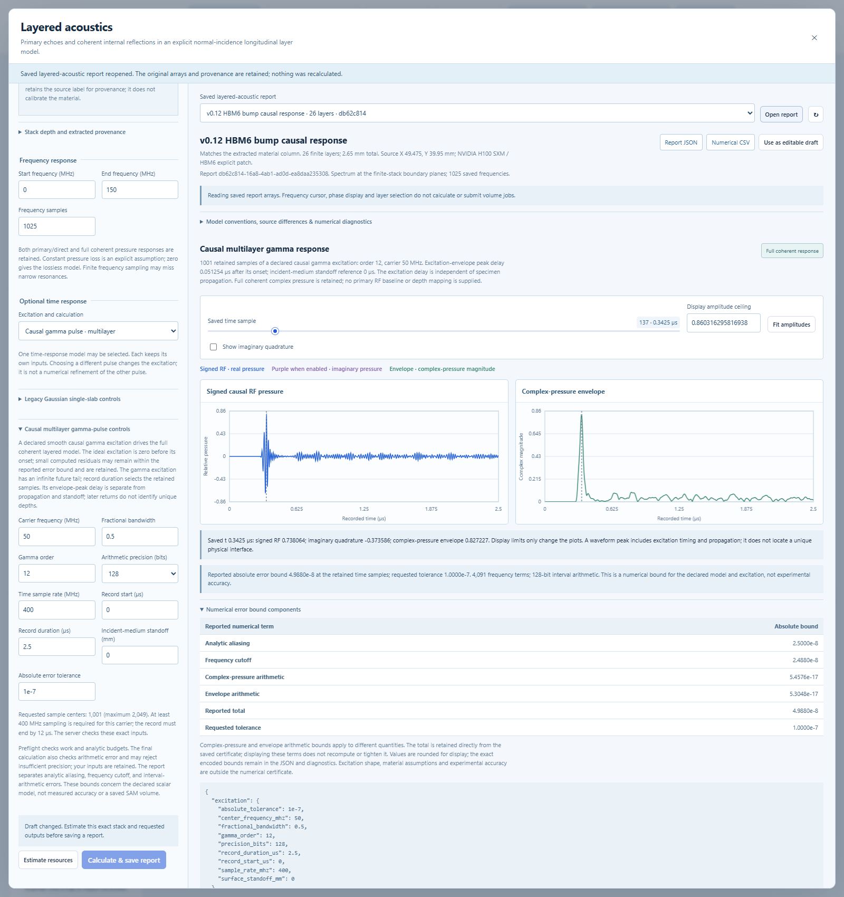

# Causal multilayer reflected pressure with an explicit gamma pulse

This guide documents the standalone v0.12 numerical kernel in
`virtual_microscopy/layered_time.py`, with model identity
`layered-causal-gamma-arb-0.12.0`, and its controls in the layered-acoustics
instrument. Independent numerical checks are described below; release and live
browser evidence is recorded in [VERIFICATION.md](VERIFICATION.md). This mode
creates standalone reports. Version 0.13 provides a separate
[saved independent-column raster](CAUSAL_SAM_VOLUMES.md) using the same kernel;
experimental calibration and focused propagation remain future work.

## Workbench workflow

1. Open **Layered acoustics** or **Inspect applied layered response** for a chosen
   HBM feature. Extract the complete material column and inspect its assumptions.
2. Select **Causal gamma pulse · multilayer** under **Optional time response**.
   Set carrier, fractional bandwidth, gamma order, time sample rate, record start
   and duration, incident-medium standoff, absolute tolerance and arithmetic
   precision. The Gaussian slab mode retains its own independent inputs.
3. Choose **Estimate resources**, then **Calculate & save report**. The estimate
   bounds contour work and analytic error. Final arithmetic acceptance occurs
   during synthesis; a request that cannot meet its bound is rejected without
   modifying the requested settings or creating a partial report.
4. Inspect signed RF and complex-pressure envelope, optionally show imaginary
   quadrature, and move the shared time cursor. Amplitude display limits change
   the view, not the retained values. The error panel separates alias, cutoff,
   complex-pressure arithmetic and envelope arithmetic from the saved total.
5. Reopen the report or download JSON/CSV. Original geometry, explicit properties,
   settings, signal arrays, certificate, implementation hashes and numerical
   library versions are retained. These operations do not create volume jobs.

The spectrum plot's selected frequency interval and count are independent of the
automatic Laplace contour used for causal synthesis. The latter may extend
beyond the plotted frequencies and is reported in the diagnostics. The scalar
constant-property model is explicit; this is not an instrument-band extrapolation
from measured material data. Small numerical pre-arrival residuals within the
accepted error bound remain in the saved output and are not clipped to zero.

## Scope and signal meaning

The calculation follows a single planar material column at normal incidence.
Each finite layer has an explicit thickness in mm, positive real longitudinal
sound speed in m/s, positive real acoustic impedance in MRayl, and optional
nonnegative constant pressure loss in dB/mm. The two exterior media are
semi-infinite. Every repeated reflection and transmission in this scalar model
is included through a coherent frequency recurrence; there is no guessed echo
amplitude floor or discretized Z grid.

The reported RF is the real part of a complex response to an explicitly chosen
complex excitation. Its imaginary part is retained, and its envelope is the
magnitude of that complex response. A causally gated gamma carrier has some
negative-frequency content, so this magnitude is not asserted to be the exact
Hilbert analytic-signal envelope of the reported real RF.

This is not an elastic full-wave solver, a focused beam, or a model of lateral
scattering, mode conversion, material dispersion or receiver response. An
extracted HBM column supplies nominal geometric and material assumptions. The
numerical certificate does not establish that those assumptions match a real
device. Repeated-echo arrival times do not identify unique physical depths.

## Pressure recurrence and causality

Use the Laplace analysis convention

\[
F(s)=\int_0^\infty f(t)e^{-st}\,dt,\qquad s=\sigma+i\omega.
\]

Time is in microseconds; angular frequency is radians per microsecond, with
\(\omega=2\pi f\) for frequency \(f\) in MHz. A layer of thickness \(d_j\)
and speed \(c_j\) has one-way delay \(\tau_j=1000d_j/c_j\) in microseconds.
For declared pressure loss \(\ell_j\) in dB/mm,

\[
P_j(s)=\exp[-(\ln 10)\ell_jd_j/20]\exp(-s\tau_j).
\]

Thus positive physical delays have negative phase under the analysis convention.
At an interface from impedance \(Z_j\) to \(Z_{j+1}\),
\(r_j=(Z_{j+1}-Z_j)/(Z_{j+1}+Z_j)\). Starting at the terminal interface and
working toward the incident medium, the effective reflection at each step is

\[
q_j=P_j^2R_{j+1},\qquad R_j=\frac{r_j+q_j}{1+r_jq_j}.
\]

Pressure coefficients, including their signs and phase, are combined before
taking any magnitude. For real \(|r|<1\),

\[
|1+rq|^2-|r+q|^2=(1-r^2)(1-|q|^2).
\]

Since \(|P_j|\le1\) for \(\Re(s)\ge0\), induction gives an analytic
reflection transfer function \(H\) satisfying \(|H(s)|\le1\) throughout
the right half-plane. The denominator cannot vanish there because
\(|1+rq|\ge1-|r|>0\). This contract is stronger than checking passivity at a
finite collection of sampled frequencies. Normalized wave scattering and delay
propagation are discussed in [Smith's Digital Waveguide Theory](https://www.dsprelated.com/freebooks/pasp/Digital_Waveguide_Theory.html).

An optional lossless incident-medium standoff \(d_s\) adds the round-trip
factor \(\exp(-s\tau_s)\), where \(\tau_s=2000d_s/c_{incident}\).
The receiver has no reflecting boundary. This standoff is a declared instrument
assumption; it is not silently identified with the existing saved-SAM water-loss
and focus operations.

## New causal excitation

For integer order \(m\), positive decay rate \(a\), carrier \(\omega_0\)
and peak time \(t_p=m/a\), define

\[
g(t)=C t^m e^{-at}e^{i\omega_0(t-t_p)}\mathbf1_{t\ge0},
\qquad C=(ae/m)^m.
\]

The envelope has unit peak, and carrier phase is zero at that peak. The pulse
starts causally at zero and has an infinite decaying future tail. It is a new
explicit excitation; it does not replace or reproduce the v0.11 four-sigma
Gaussian pulse. Recording time zero refers to excitation onset, not its envelope
peak. At a lossless front interface, that peak appears at \(\tau_s+t_p\).

For the declared fractional amplitude bandwidth \(B\) and carrier \(f_0\),

\[
a=\frac{\pi f_0B}{\sqrt{2^{2/(m+1)}-1}}.
\]

This makes the full width between the two half-amplitude points of the complex
pulse spectrum equal to \(Bf_0\). Those are amplitude half-maximum points,
approximately -6.02 dB; they are not half-power points. The Laplace transform is

\[
G(s)=e^{-i\omega_0t_p}\frac{D}{(s+a-i\omega_0)^{m+1}},\qquad D=Cm!.
\]

This transform follows from the [NIST gamma integral](https://dlmf.nist.gov/5.9.E1).
It evaluates the entire excitation without a numerical pulse-support cutoff.

## Three independent numerical error contributions

The finite causal recording is reconstructed from complex contour samples.
Choose \(\sigma>0\), period \(T\) strictly greater than the final requested
time \(b\), frequency step \(\delta=2\pi/T\), and modes
\(s_k=\sigma+i(\omega_0+k\delta)\), for \(-K\le k\le K\).
The inverse sum is

\[
y_K(t)=\frac{e^{(\sigma+i\omega_0)t}}{T}
\sum_{k=-K}^{K}H(s_k)G(s_k)e^{ik\delta t}.
\]

The output is evaluated at the actual supplied binary64 time values. If recording
start, duration or sample-rate metadata is supplied, all three fields are
required and must exactly match the supplied centers constructed as
`start + i/sample_rate`. Contradictory metadata, including a one-ULP coordinate
mismatch, is rejected. Without recording metadata, valid nonuniform time centers
remain supported. This
carrier-centered frequency grid is numerical quadrature, not the instrument's
time sampling rate or a physical resolution claim. In particular, layer delays
are not rounded to a temporal or depth grid.

**Periodization alias.** Passivity and the integrable excitation spectrum imply
\(|y(t)|\le C_0\), where

\[
C_0=\frac1{2\pi}\int_{\mathbb R}|G(i\omega)|\,d\omega
=\frac{D\,\Gamma(m/2)}{2\sqrt\pi\,\Gamma((m+1)/2)a^m}.
\]

The gamma ratio follows from the [beta integral](https://dlmf.nist.gov/5.12.E1).
For the exact infinite inverse sum and **\(0\le t<T\)**, periodization gives

\[
y_T(t)-y(t)=\sum_{j\ge1}e^{-(\sigma+i\omega_0)jT}y(t+jT),
\qquad E_{alias}\le\frac{C_0}{e^{\sigma T}-1}.
\]

This controls future response that would otherwise wrap into the recording.
There is no extra \(e^{\sigma b}\) factor in this particular bound. For
\(t\ge T\), earlier responses can alias with growing weights, which is why
the first-period restriction is required. The exact infinite trapezoidal
discretization error is this alias term; it is not an additional unknown error
to count twice. [Whitt's transform-inversion notes, section 4](https://www.columbia.edu/~ww2040/IEOR3106F06/ExtraCreditLectureLT.pdf)
explain the periodization construction.

**Finite frequency omission.** Bounding the two omitted gamma-transform tails
with the integral test gives, for \(K>0\) and \(t\le b<T\),

\[
E_{cut}\le\frac{e^{\sigma b}D}{\pi m(K\delta)^m}.
\]

This is a frequency cutoff error. It is distinct from a dropped-echo tail, a
temporal sample spacing, or finite recording duration. The entire infinite gamma
pulse and the continuous repeated-reflection transfer function enter the model.

**Arithmetic enclosure.** Coefficient evaluation and inverse summation require
validated complex arithmetic, including the input interpretation, constants,
layer delays/loss, exponentials, interface ratios, pulse transform, sum weights,
and final undamping. If retained coefficients have absolute errors bounded by
\(\eta_k\), their propagated contribution is at most
\(e^{\sigma b}\sum_k\eta_k/T\), before adding subsequent arithmetic errors.
An energy check, an agreement with higher precision, or a final `nextafter` does
not supply missing bounds for intermediate operations.

The kernel performs these operations with Arb/Acb ball arithmetic through
python-flint. It evaluates the inverse in blocks of 32 polynomial coefficients
with independent complex phases, bounding the actual returned binary64 numbers
against the resulting enclosures. It does not rely on an unbounded NumPy FFT
roundoff assumption. Ball arithmetic tracks midpoint/radius enclosures through
real and complex operations; see [Johansson's Arb paper](https://fredrikj.net/math/arbpaper.pdf)
and the [python-flint real-ball documentation](https://python-flint.readthedocs.io/en/stable/arb.html).

The implementation reports a total absolute pressure bound that includes
alias, cutoff, validated complex evaluation, and conversion to displayed numbers.
The envelope conversion also needs an enclosure; the magnitude map itself is
1-Lipschitz, so complex signal error bounds its physical magnitude error. A
requested tolerance must be rejected if the combined certificate cannot close
at the chosen precision and resource limits. Larger damping reduces aliasing
while amplifying other errors, so it is not a universal accuracy improvement.

The guarantee applies at the returned time centers. Plot interpolation and an
unobserved continuous-time extremum do not acquire a certificate simply because
nearby saved samples do. The input values interpreted by the kernel are the exact
represented binary64 numbers; the bounds do not include a difference between
those numbers and an intended decimal or uncertain measured quantity.

## Current admission limits

The period is selected as `max(1 us, 4*last_actual_time_us)`. One quarter of the
requested tolerance is allocated to aliasing and one quarter to frequency
omission. The remaining budget must cover the computed arithmetic enclosure;
successful estimation does not promise that synthesis will satisfy it.

| Quantity | Current bound |
| --- | --- |
| Finite layers | 0–256, total thickness at most 6 mm |
| Impedance / longitudinal speed | 0.0001–100 MRayl / 100–20,000 m/s |
| Constant pressure loss | 0–100 dB/mm |
| Carrier / fractional amplitude bandwidth | 10–150 MHz / 0.2–1 |
| Gamma order | Integer 4–24 |
| Requested absolute pressure tolerance | 1e-12–1e-3 |
| Arb precision | 64, 96, 128, 192 or 256 bits |
| Actual recorded time centers | 2–2,049, strictly increasing, within 0–12 us |
| Largest adjacent time gap | At most one eighth of the carrier period, with the declared small floating comparison tolerance |
| Lossless incident standoff | 0–5 mm |
| Retained contour frequencies | At most 16,385 |
| Frequency × (layer count + 1) work | At most 5 million units |
| Frequency × recorded-time work | At most 25 million units |
| Estimated kernel workspace | At most 96 MiB, excluding total process RSS |

The conservative workspace estimate includes a 24 MiB base plus 2,048 bytes per
retained frequency, 2,048 bytes per returned time and 1,024 bytes per finite layer.
Zero-thickness entries are removed from physical scattering, while the requested
layer count still participates in conservative preflight work. A rejection never
silently decreases the frequency work, pulse order, requested precision or accuracy.

## Independent verification

`tests/test_layered_time.py` contains 57 passing tests at the current kernel
checkpoint. Independent tests construct a front-interface gamma response, a finite causal
slab echo series, and a short-window two-layer event tree using pressure
transmission/reflection coefficients. They must compare both complex pressure
and magnitude against the reported total bound. Additional checks cover matched
media, reversed polarity, loss and high contrast, zero-thickness removal,
identical-layer subdivision, exact supplied time centers, shared-window
invariance, precision/tolerance changes, and early invalid/resource rejection.
The low-precision regression requests 1e-12 at 64 bits and confirms explicit
failure, then obtains a certified result at 128 bits for the same physical request.

For reproducible examples in that file, ordinary binary64 oracle calculations
gave the following maximum complex discrepancies. These observed differences are
validation evidence, not substitutes for the enclosure calculation.

| Independent oracle fixture | Maximum observed complex difference | Kernel total absolute bound |
| --- | ---: | ---: |
| Symmetric slab, impedances 1.48 / 8 / 1.48 MRayl | 1.532e-10 | 4.961e-8 |
| Reversed-polarity slab with 0.7 dB/mm pressure loss | 1.332e-10 | 4.961e-8 |
| High-contrast slab, internal impedance 0.0004 MRayl | 2.421e-10 | 4.961e-8 |
| Slab with 100 dB/mm declared pressure loss | 1.496e-10 | 4.961e-8 |
| Two unequal layers, 37 independently enumerated causal propagation events | 2.042e-10 | 4.988e-8 |

The slab cases use thickness 0.175 mm, speed 4,000 m/s, a 0.05 mm incident
standoff, 321 samples through 0.8 us, and the default 50 MHz, order-12 excitation.
The two-layer case uses the full explicit fixture in the test; no production
frequency recurrence or v0.11 slab-series helper supplies its oracle.

An additional model-scale test extracts the full 26-layer, 2.65 mm HBM6 column at
global X=49.475 mm, Y=39.95 mm from the public microstructure example. It compares
the shared actual times of two independently admitted recording windows/periods
against their combined bounds and confirms that no input layers changed. This
tests window consistency and admission on the model; it is not an independent
measurement or complete analytic HBM waveform oracle.

These numerical fixtures test the declared equations. They do not establish
material accuracy, measured transducer bandwidth, defect detectability, feature
resolution, or the equivalence of the new excitation to existing saved data.
Finite layer count, frequency-work, inverse-sum-work, output-size and memory
limits must be enforced before expensive allocations. A failed resource or
arithmetic bound must produce an explicit rejection without altering the stack,
excitation, record, or requested tolerance.
