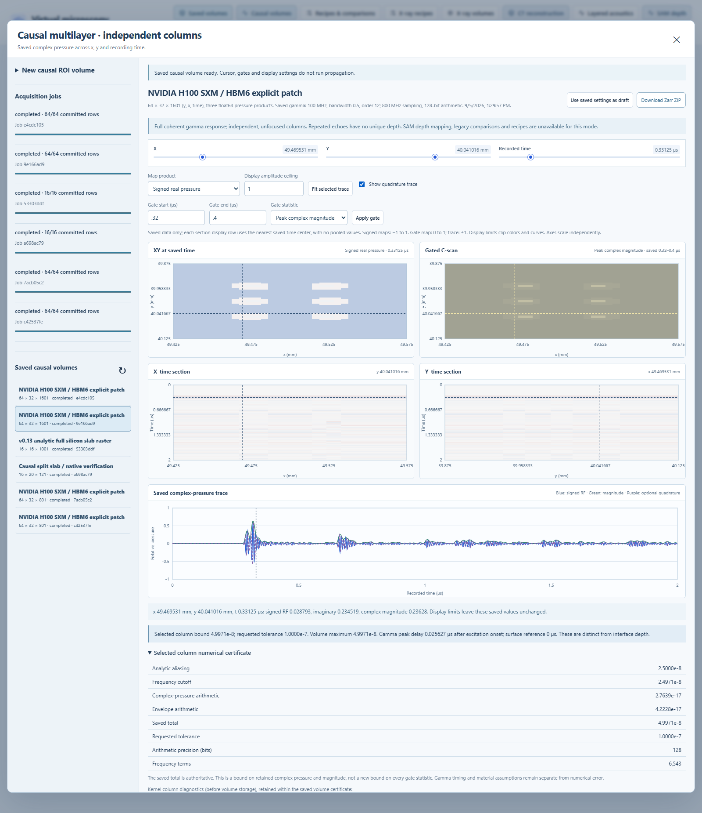

# Saved causal column-response volumes

Version 0.13 introduces the explicitly selected `sam_causal_rf_volume` dataset.
It stores the response of complete, independent, unfocused material columns to
the [v0.12 causal gamma excitation](CAUSAL_LAYERED_RF.md). Signed real pressure,
imaginary quadrature, complex-pressure magnitude, actual coordinates and error
bounds are retained. The existing primary/Gaussian SAM volume remains a separate
instrument model with its original settings and data contract.

This is a synthetic normal-incidence scalar model. Independent columns do not
represent a focused beam, lateral scattering or full elastic propagation.
Repeated returns and gamma pulse latency do not identify unique physical depths.
The ordinary SAM depth mapper therefore rejects this dataset kind.

## Acquire and inspect

1. Load the H100 microstructure specimen or a supported authored twin. Open
   **Causal volumes**, or use **Causal volume from applied patch** for an applied HBM patch.
   The full specimen is captured; the ROI chooses global X/Y sample centers and
   retains every intervening material along the complete specimen depth.
2. Review the explicit independent-column model and ROI. The HBM preset uses
   32 × 64 positions over a 0.15 × 0.25 mm patch. Applying a preset is a visible
   action; admission never silently coarsens a request or changes its tolerance.
3. Set the gamma carrier, fractional amplitude-spectrum bandwidth, pulse order,
   time sample rate, recording start/duration, incident-medium standoff, requested
   absolute tolerance and arithmetic precision. Nominal positive material
   properties and lossless layers/water exteriors are explicit assumptions.
   Focus and voxel Z sampling are not parameters of this response.
4. Estimate the actual full-depth column classes, work, output bytes and numerical
   workspace, then start the queued acquisition. Final arithmetic acceptance
   occurs during synthesis; a successful estimate does not guarantee it.
5. Inspect linked XY, X–time, Y–time and A-scan views. Choose signed real pressure,
   signed quadrature or complex magnitude. Time sections retain the actual
   centers without time pooling. Gates process saved samples and create no new
   acquisition. The viewer shows requested gate bounds and included sample bounds.
6. Reopen or export the immutable result as a Zarr ZIP. The archive contains
   the exact arrays and their frozen manifest. Display limits, cursors and gates
   do not alter the saved numerical data or create a new certificate.

## Geometry, excitation and observation

`continuous_columns_v1` constructs complete material paths at the actual global
binary64 X/Y centers. It retains the established primitive precedence, explicit
air versus ambient water, endpoint/coincidence contract, defect inclusion and
all six HBM assemblies in the frozen source. It does not use voxel-center Z
sampling or the primary-echo conversion that discards weak interfaces.

`layered_causal_gamma_v1` evaluates the full coherent scalar layer response with
the explicit gamma pulse exactly once. Its finite layer properties are the
represented nominal impedance, longitudinal speed and thickness values, with
zero pressure loss in this first raster implementation. Both exterior media
are water. Standoff adds a lossless round-trip delay with a nonreflecting receiver.
It does not inherit the primary model's frequency-dependent loss or focus gains.

`independent_columns_v1` is identity observation: it copies the accepted complex
and magnitude doubles. There is no lateral blur, convolution, amplitude
normalization, focus weighting, inferred depth or envelope reconstruction.
Identity observation requires no lateral halo. A future finite beam operator
must retain its complete declared support and propagate its own coefficient,
accumulation and output-conversion bounds before it becomes selectable.

The complex gamma magnitude is not asserted to be the exact Hilbert envelope
of the real RF. Time zero refers to gamma onset at the transducer; the excitation
has a separate onset-to-peak delay. A later waveform peak includes excitation
timing and one or more propagation paths.

## Exact class reuse and numerical bounds

A bounded geometry pass resolves each complete column before signal synthesis.
Reuse requires identical canonical numerical stack values, exterior media,
gamma/pulse settings, actual time coordinates, precision and model identity.
Material names or approximately equal endpoints are insufficient. Separate
geometric path signatures retain provenance even when represented physical
parameters produce an identical scalar response.

Each distinct accepted response supplies float64 real, imaginary and magnitude
vectors plus the original v0.12 numerical certificate. Its total includes
analytic periodic aliasing, omitted contour frequencies, validated Arb arithmetic
and conversion to the actual returned doubles. Copying these values into a
float64 raster introduces no further arithmetic. The saved per-column bound
covers both complex pressure and magnitude at every retained time center; the
volume bound is their maximum.

These bounds concern the declared equations and represented stack inputs. They
exclude intersection rounding, geometry/material uncertainty, lateral sampling,
unmodeled wave physics and experimental accuracy. Plot interpolation and derived
gate statistics do not acquire a new numerical certificate. The provisional
reference-image scale of approximately 4.6 µm/pixel remains separate metadata.

## Stored products and lifecycle

| Product | Dtype and axes | Meaning |
| --- | --- | --- |
| `rf` | float64 `[y,x,time]` | Signed real pressure |
| `imaginary` | float64 `[y,x,time]` | Signed imaginary pressure |
| `envelope` | float64 `[y,x,time]` | Original complex-pressure magnitude |
| `error_bound` | float64 `[y,x]` | Original per-column absolute numerical bound |
| `class_index` | uint16 `[y,x]` | Frozen exact-response class |
| `x_mm`, `y_mm`, `time_us` | float64 vectors | Actual evaluation centers |

The first format uses canonical uncompressed little-endian Zarr chunks. Each
signal/error chunk is one complete output row; the class map and coordinate
arrays are immutable. The manifest retains the full twin/material snapshots,
resolved class table, geometry signatures, pulse/observation definitions,
implementation hashes and Python/NumPy/Zarr/python-flint/native-FLINT identity.

A row is committed only after all three signal arrays and its error map have
been written and read back, with their class certificates published atomically
in the manifest. Incomplete rows are unavailable to numerical views and exports.
Cancellation is checked between bounded class solves and row commits. Resume
verifies the original numerical identity and reconstructs cached classes from
verified committed representative columns; it does not recalculate those classes.
Missing or corrupted partial rows can be regenerated under that same identity.
Previously committed certificates and completed datasets remain immutable.

Completed read/export checks frozen identities, typed bytes, canonical metadata,
paths, coordinate maps, certificates and completion records without running the
current kernel or requiring a matching installed FLINT version. Checksums verify
the saved numerical assertion and data integrity; they are not new experimental
validation or a cryptographic proof of how a dataset was created.

## Admission limits

| Quantity | Bound |
| --- | --- |
| X/Y positions | 16–64 per axis; at most 4,096 columns |
| Actual saved time centers | 2–2,049 within 0–12 µs; at least eight per carrier period |
| ROI | Inside the twin; width and height at least 0.05 mm |
| Aggregate inverse work | At most 100 million contour-frequency × time-sample units over exact classes |
| Aggregate layer-frequency work | At most 5 million units over exact classes |
| Output / estimated numerical workspace | At most 512 MiB each; workspace is not total process RSS |
| Frozen plan / manifest JSON | At most 8 MiB serialized and 32 MiB conservatively expanded |

All individual [v0.12 kernel limits](CAUSAL_LAYERED_RF.md#current-admission-limits)
also apply. Preflight includes complete path construction, exact class registry,
response cache, one active Arb solve, row/I/O copies, coordinates, error maps and
metadata. Disk admission includes pending jobs and the existing free-space reserve;
compression savings are not assumed. A configuration beyond any limit is rejected
without dropping columns, layers or echoes, changing its pulse, or relaxing its
requested numerical tolerance.

Version 0.14 adds a separate [compatible causal comparison](CAUSAL_COMPARISONS.md)
workflow for these saved sources. Recipes, parameter batches, ordinary SAM
comparisons, depth conversion and focused observation are not enabled for this kind. Historical primary SAM,
X-ray, CT/depth data and standalone layered reports retain their established
contracts. Executed numerical, storage, browser and release evidence is recorded
in [VERIFICATION.md](VERIFICATION.md).
