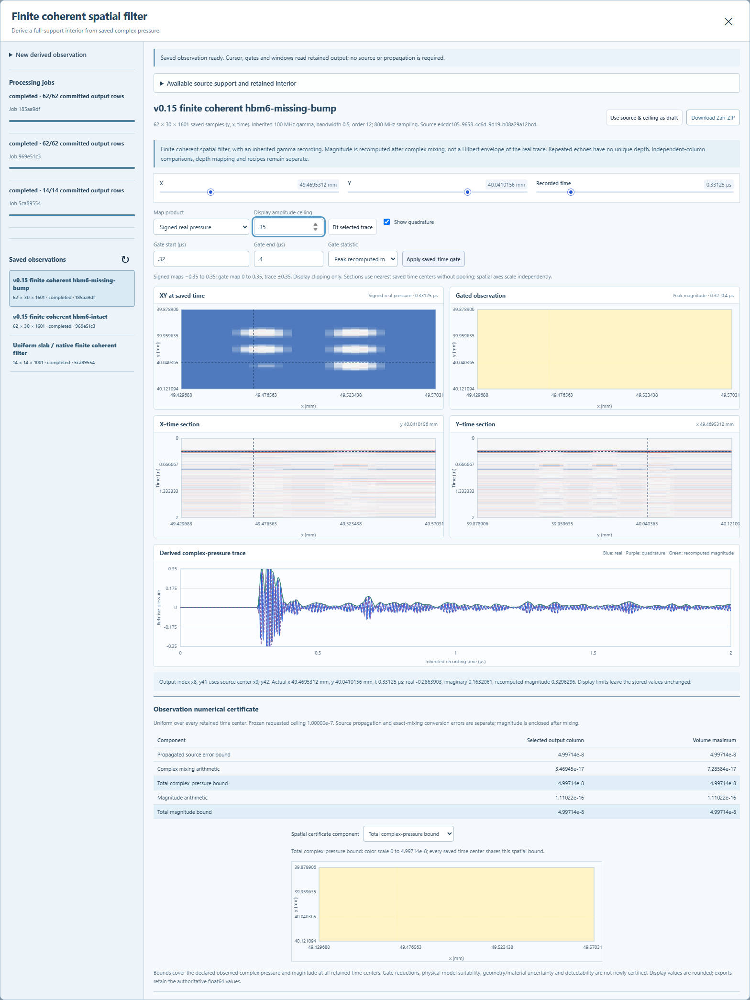

# Finite coherent spatial observations

Version 0.15 derives a saved spatially filtered volume from a completed causal
SAM recording. The operator mixes signed complex pressure at nine neighboring
scan positions at each original recording time, then recomputes magnitude. This
is a declared discrete observation of the synthetic columns. Its support follows
the saved scan pitch; it is not a calibrated transducer beam or a physical
resolution measurement.

## Using the workspace

1. Click **Spatial filter** in the toolbar, or **Apply spatial filter** in a
   completed causal volume, to open **Finite coherent spatial filter**. Select a
   saved independent-column source, give the result a name, and choose its
   absolute numerical tolerance.
2. Inspect the estimate. The source's outermost row and column on every side
   supply context and are omitted from the result. A 16 × 16 source yields
   14 × 14 output positions. The complete saved time axis is retained.
3. Start the derived job. Progress counts complete output rows. Cancel preserves
   committed rows; resume verifies the original source, implementation identity
   and committed chunks before continuing.
4. Inspect real pressure, quadrature and the recomputed complex magnitude with
   linked XY, X–time, Y–time and A-scan views. Readouts include actual source
   indices and physical centers. A recording-time gate selects peak magnitude
   or RMS real pressure without submitting another job.
5. Inspect the five numerical-bound maps, selected-column values and volume
   maxima. Export the typed Zarr ZIP or reopen the completed derived dataset.
   Its own views and export remain available when the parent source is absent.



Only the completed `sam_causal_rf_volume` kind with supported v0.13 excitation,
observation, certificate and coordinate contracts is accepted. The new kind is
`sam_coherent_observation_volume`. Primary-echo recipes, ordinary depth mapping
and the v0.14 causal-comparison workspace retain their existing kind boundaries.

## Operator and spatial support

For each retained center and time, the exact discrete target is

```text
W = (1/16) * [[1,2,1], [2,4,2], [1,2,1]]
Z(y,x,t) = sum over a,b in {-1,0,1}:
           W[a+1,b+1] * (source_rf(y+a,x+b,t) + i*source_imaginary(y+a,x+b,t))
```

The matrix is a stencil: each entry multiplies its corresponding neighbor once.
The coefficients are nonnegative, sum exactly to one, are exactly representable
in binary64, and introduce zero additional phase. Components are accumulated
using exact integers before one nearest-even float64 conversion. Magnitude is
computed from those returned components and checked with exact square brackets.
Equal finite complex input fields are preserved numerically; exact zero is
stored as positive zero. Opposite phases can cancel even when the individual
source magnitudes are large.

Every output needs all nine recorded positions. There is no padding, invented
outside response, resampling, envelope averaging or derived-on-derived input.
Output X/Y vectors copy the source interior byte for byte; time copies the full
source vector. The frozen v0.13 generation sequence is checked exactly. Decimal
coordinate origins can legitimately produce slightly different adjacent
float64 differences. Crop boundaries are exact midpoints of discarded and
retained centers with one final float64 rounding. The manifest preserves actual
neighbor offsets, source bounds, indices, complete source provenance and weights.

## Numerical certificate

Each output column has five float64 maps, constant over its saved time record:

| Product | Meaning |
| --- | --- |
| `source_propagation` | Upward-rounded sum of the nine weighted source complex-pressure bounds |
| `complex_arithmetic` | Upward enclosure of the maximum over time of the exact real and imaginary conversion errors added in absolute value |
| `complex_total` | Upward enclosure of the sum of the two published components above |
| `magnitude_arithmetic` | Maximum verified magnitude-rounding radius over time, relative to the returned complex components |
| `magnitude_total` | Upward enclosure of published complex total plus published magnitude allowance |

The component error sum conservatively encloses the complex Euclidean error.
Magnitude's unit Lipschitz property propagates the complex total through absolute
value. Published totals enclose the exact sum of the already-published bounds,
including their outward rounding. Both totals must satisfy the requested
tolerance. A request below the source-propagation floor rejects during estimation;
an arithmetic budget failure cannot publish a row.

These bounds describe the specified numerical model and returned samples. They
do not quantify uncertainty in the H100 geometry, nominal material constants,
reference-image scale or an actual microscope. Gate maps are ordinary saved-data
statistics with no additional certified reduction bound. Repeated reflections
retain recording time and cannot be assigned a unique physical depth.

Source-aware publication checks independently re-evaluate the complex sums and
check the actual frozen source bytes. Historical reads verify typed hashes,
source-bound propagation, total composition and magnitude brackets without a
forward solver. Without the original source waveforms they cannot reconstruct
the weighted-sum conversion maxima; those were established at publication and
are retained with immutable provenance and content hashes. Hashes detect changed
content relative to the saved record; they are not an external signature.

## Storage, jobs and limits

The derived Zarr v3 dataset contains three float64 `[y,x,time]` signal arrays,
five float64 `[y,x]` bound maps, and X/Y/time coordinates. Canonical uncompressed
little-endian chunks commit one whole output row together with typed checksums.
The source remains unchanged. Completed datasets are immutable; partial resume
requires the matching source and observation implementation.

Supported source axes contain 16–64 X/Y positions and 2–2,049 time centers, with
at most 3,000,000 output complex samples. This permits a 64 × 32 × 1,601 HBM
source to yield 62 × 30 × 1,601 output. Work is capped at 54 million weighted
component terms. Processing streams a three-row neighborhood and one output row
at a time, with bounded copies and readback included in the estimate. It checks
cancellation within blocks of at most 64 time samples and at publication.
Source verification and finalization also check cancellation at their boundaries.

The canonical estimate accounts for typed outputs, provenance, row registries
and owned workspace, with 512 MiB output and workspace limits. These are owned
operation estimates, not whole-process RSS guarantees. One composed manager and
one owned child worker alternate eligible old acquisition and new derived jobs.
Old batch ordering and holds remain effective. Both queues share pending disk
reservation checks. ZIP exports reserve their future bytes before copying and
release the reservation after the closed file occupies disk. Copying holds no
database write transaction or manager mutex. New admissions retain the full
export reservation; already-running worker checks avoid charging its physical
growth twice. Startup releases stale reservation records while retaining orphan
file bytes. HTTP processing locks are process-local and do not imply
global exclusion between background work and read-only HTTP inspection.

API routes live under `/api/v2/observations`: `POST /estimate`, `POST /jobs`,
job list/detail/cancel/resume, and dataset list/detail/view/export. Lists accept
`limit=1..100` and `offset=0..9999`. Requests accept only `kind`, `name`,
`source_dataset_id`, `operator: "binomial_3x3_coherent_v1"`, and
`absolute_tolerance` (default `1e-7`, admitted range `1e-12..1e-3`). Unknown fields
reject. View parameters select actual saved indices, product, gate boundaries
and `peak_envelope` or `rms_rf`; they do not modify saved arrays.

See [VERIFICATION.md](VERIFICATION.md) for tested behavior and delivered HBM
evidence, and [EXPANSION_PLAN.md](EXPANSION_PLAN.md) for remaining model work.
