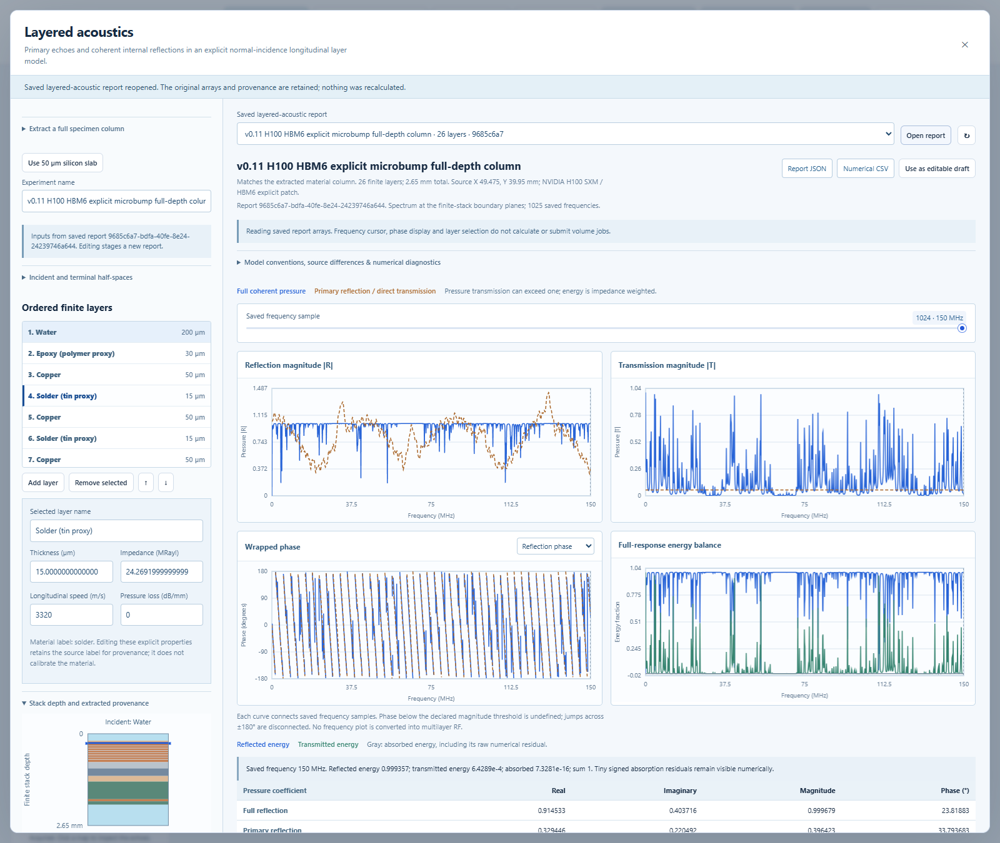

# Layered acoustics instrument — version 0.11

Version 0.12 extends this instrument with a separately selected [causal
multilayer gamma-pulse response](CAUSAL_LAYERED_RF.md), including full HBM column
RF and a combined analytic/arithmetic certificate. The original spectra and
Gaussian single-slab behavior documented below remain available.

This standalone instrument compares primary reflections with coherent repeated
reflections through an explicit stack. It provides complex pressure spectra for
many layers and a certified causal echo series and RF trace for one finite slab.
It is a scalar, normal-incidence longitudinal approximation with assumed material
properties. It does not change the saved SAM forward model or create SAM volume
datasets, and it has no experimental calibration.



## Inspect a specimen column

1. Open **Layered acoustics** from the main workbench, or choose **Inspect applied
   layered response** in the HBM assembly laboratory to use the selected applied
   feature's actual center. Select the HBM6 explicit-patch specimen to inspect
   the modeled bump and TSV column.
2. Extract at the chosen global X/Y, with explicit defect participation. Extraction
   retains the complete specimen from z=0 to its bottom, using the existing
   continuous primitive intersection and overwrite contract. It does not crop
   away the substrate, interposer or surrounding water. The complete six-site
   source twin remains in the report; one column does not traverse every site.
3. Inspect the ordered finite layers and their depth diagram. Edit thickness
   (displayed in micrometres), impedance in MRayl, longitudinal speed in m/s and
   constant pressure loss in dB/mm. Incident and terminal media are semi-infinite;
   extraction initializes both to water. Added manual layers and reordered or
   edited source layers become explicit assumptions. Exact zero-thickness layers
   contribute no physical thickness and collapse algebraically in the kernel.
4. Set the frequency interval and sample count. **Estimate** checks numerical and
   report budgets. **Calculate & save** creates an immutable report. The source
   status distinguishes matching extraction, modified extraction and manual input.
5. Inspect pressure magnitudes, wrapped phase and full-response energy with the
   shared frequency cursor and retained complex values. The primary/direct curves
   share the same properties but omit repeated reflections. A displayed curve
   connects discrete samples; it does not certify between-sample resonances.

Extracted materials use nominal library impedances and speeds and **zero loss**
by default. The existing SAM library's illustrative frequency-dependent losses
are not silently used here. An edited material label preserves source identity;
it does not imply that the new explicit properties have been measured. One
geometrical column also supplies no beam width, lateral scattering or resolution
measurement. Source geometry remains independent of the editable acoustic model.

## Inspect signed slab RF

Choose **Use 50 µm silicon slab** for a water–silicon–water example. Enable the
single-slab pulse and set carrier frequency, fractional bandwidth, sample rate,
record start/duration, incident-medium standoff, aggregate omitted-echo tolerance
and maximum echo count. RF requires exactly one positive-thickness finite layer;
unsupported multilayer RF is rejected without substituting another model.

The pulse has a unit-peak complex Gaussian envelope, evaluated directly at actual
recorded time centers and cut at four envelope standard deviations. Signed RF is
the real part of the coherent sum; envelope is its magnitude after summation.
The independently calculated primary trace includes the front and first internal
return. Hover to inspect time and amplitude. Later multiples have no unique
reflection depth. The reference time can exist without a surface echo when the
front impedances match. Symmetric pulse support before its peak does not identify
an earlier physical interface.

The global omitted-echo amplitude bound applies to the declared compact pulse,
excluding roundoff. A separate bound records the difference from an infinite
Gaussian due to the four-sigma cutoff. Neither bound is an instrument-accuracy
statement. Standoff adds a lossless incident-medium round trip to all impulse
times; the receiver does not create an exterior reflecting cavity.

## Equations and conventions

Pressure reflection and transmission at an interface from i to j are
`r_ij=(Z_j-Z_i)/(Z_j+Z_i)` and `t_ij=2 Z_j/(Z_j+Z_i)`, with
`r_ji=-r_ij` and `t_ij*t_ji=1-r_ij²`. A pressure transmission coefficient can
exceed one. These scalar boundary relations follow [Staelin's MIT notes,
section 13.2.1, equations 13.2.19–13.2.21](https://live.ocw.mit.edu/courses/6-013-electromagnetics-and-applications-spring-2009/d3be4ea78b036a6362230fb41780cf54_MIT6_013S09_notes.pdf#page=406).

Fourier analysis uses `exp(-i*omega*t)`; delay tau contributes
`exp(-i*omega*tau)`. In layer j, with thickness d in mm and speed c in mm/µs,
the one-way propagation factor is `P=exp(-alpha*d-i*2*pi*f*d/c)` for f in MHz.
Here `alpha=ln(10)*loss_db_per_mm/20` is pressure attenuation in nepers/mm.
The constant, nonnegative per-layer loss is an assumed nondispersive model,
not a broadband material law inferred from measured absorption.

The implementation derives a backward scattering recurrence from the interface
relations and the geometric sum of returning waves. Let `R_next,T_next` be the
already-composed response below a layer, and let r,t be its entry-interface
coefficients. Start at the final interface and work toward the incident face:

```text
q = R_next * P²
D = 1 + r*q
R = (r + q) / D
T = t*P*T_next / D
```

The positive sign in D uses the reversed reflection coefficient `-r`.
The recurrence uses decaying propagation factors and rejects poorly conditioned
denominators rather than clipping them. This choice addresses the growth risks
of naive transfer matrices in absorbing layers discussed in [Lévesque and Piché's
NRC record](https://publications-cnrc.canada.ca/eng/view/object/?id=056a54bb-ab25-4f71-8161-43b193d53a23).
That reference motivates stability scrutiny; the implementation's correctness is
checked separately against independent analytical fixtures.

Reflection is referred to the incident face at z=0, and transmission to the face
after all finite layers. Spectra exclude external standoff. Full-response energy
is `E_R=|R|²`, `E_T=(Z_incident/Z_terminal)*|T|²`, and `E_A=1-E_R-E_T`.
The kernel rejects lossless conservation or passive-loss violations outside its
`1e-10` tolerance. Tiny signed residuals remain unmodified in saved outputs.
Energy certification applies to the full coherent solution; a primary-echo
truncation is not separately constrained to conserve total energy.

For a single slab, the independent causal series is:

```text
front: time 0, amplitude r01
A1 = t01*t10*r12*exp(-2*alpha*d)
q  = r10*r12*exp(-2*alpha*d)
internal return n >= 1: time 2*n*d/c, amplitude A1*q^(n-1)
after N internal returns: omitted absolute amplitude <= |A1|*|q|^N/(1-|q|)
```

The requested tolerance determines N, independently of the recording window.
Exceeding the allowed echo/work budget is an error. There is no IFFT, circular
wraparound or hidden per-echo floor. Shared samples are invariant under changing
the record origin/window within floating-point tolerance. The assumed pulse is
`exp(-0.5*(dt/sigma)²)*exp(+i*2*pi*f0*dt)`, with
`sigma=sqrt(2*ln(2))/(pi*bandwidth*f0)`, and is zero for `|dt|>4*sigma`.

## Controls and admission

| Control or resource | Public bound |
| --- | --- |
| Finite layers / total finite thickness | 0–256 / at most 6 mm |
| Explicit positive real impedance | 0.0001–100 MRayl |
| Longitudinal speed | 100–20,000 m/s |
| Constant pressure loss | 0–100 dB/mm, finite layers only |
| Spectral interval / requested samples | 0–300 MHz / 2–8,193 |
| Slab carrier / fractional bandwidth | 10–150 MHz / 0.2–1 |
| Sample rate | at least 8 × carrier; at most 2,400 MHz |
| Record duration / absolute end | 0.05–12 µs / at most 12 µs |
| Recorded time centers | at most 16,384 |
| Incident-medium standoff | 0–5 mm |
| Omitted-echo tolerance / maximum count | 1e-12–1e-3 / 1–100,000 |
| Spectrum / conservative pulse work | 5 million layer-frequency / 25 million echo-sample units |
| Estimated numerical/serialization workspace | 256 MiB |
| Saved JSON / expanded JSON budget | 16 MiB / 64 MiB |

Limits act together, so a combination of individually valid settings can exceed
the aggregate resource budget. Pulse work includes both the full echo series and
the independently synthesized primary baseline. Preflight reports its conservative
allocation model, not total process RSS or a guaranteed runtime. Finite requests
that make the kernel ill-conditioned or unrepresentable are also rejected.

## Saved reports and reproducibility

Reports retain normalized input, original extraction and full twin when present,
explicit edited properties, differences, complex spectra, energy, time arrays,
echo amplitudes/times, diagnostics, estimates, material snapshot, package versions,
implementation-file fingerprints and hashes. A report is an immutable standalone
analysis, separate from acquisition jobs and volume datasets.

Reopening and JSON/CSV export verify retained hashes without invoking the current
solver or validating historical input with a newer schema. The CSV uses
`section,field,value_json` rows so arrays and nested metadata can reconstruct every
field. Display cursor and phase choices read saved arrays. Changing inputs stages
a new report and visibly marks the previous result as using its original inputs.

The headless delivery verifier creates a new output directory and refuses an
existing one before API calls:

```powershell
uv run python -m tools.verify_layered_acoustics --help
```

See [VERIFICATION.md](VERIFICATION.md) for the executed analytical, persistence,
live browser and source-preservation checks. [LAYERED_ACOUSTICS_SPEC.md](LAYERED_ACOUSTICS_SPEC.md)
retains the wider target of opt-in saved SAM ROI acquisition. Version 0.12 adds
the certified general-column time response for its distinct gamma excitation;
the saved ROI integration remains planned. Passivity
alone cannot bound an IFFT ringing tail, and multiplying branching paths through
many high-contrast layers can exceed practical computation. Focused elastic
propagation, oblique incidence, shear conversion, measured pulses and material
calibration remain later model extensions.
