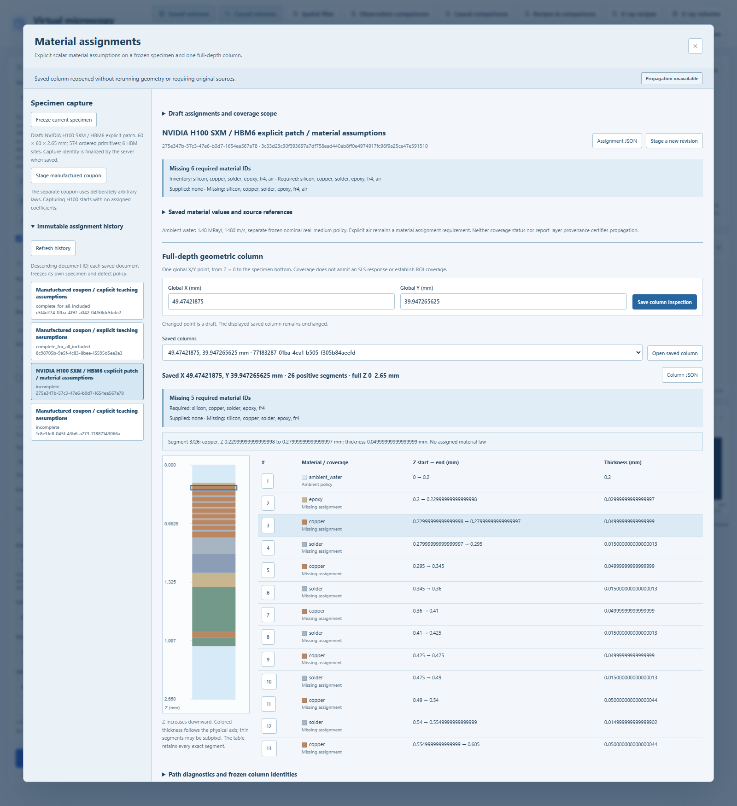

# Material assignments and full-depth coverage

Version 0.19 adds an explicit connection between a frozen geometric twin and
authored scalar SLS material assumptions. The **Material assignments** workspace
records these assumptions and inspects one full-depth material column. It does
not calculate a new spectrum, RF trace, acoustic raster or X-ray acquisition.

## Workflow

1. Load or edit the specimen, choose whether to include defects, and open
   **Material assignments**. Capture the current twin. Its compiled primitive
   order, HBM assembly metadata, reference metadata and dimensions are retained.
2. Choose coverage for all included material IDs or an explicitly selected subset.
   The inventory is conservative: even a fully occluded primitive contributes its
   material ID. Empty or incomplete assignments can be saved with missing coverage.
3. Add a binding for a material ID. Every included occurrence of that ID receives
   the same assumption. Different formulations of epoxy in different objects
   require a future object-specific binding contract.
4. Author the four material parameters and an explanatory note, or explicitly
   select one finite layer of an existing saved SLS analysis. Referenced values
   are copied exactly and remain read-only in that binding.
5. Save the assignment, enter global X/Y coordinates, and inspect the entire
   specimen depth. Save and export the column evidence together with its complete
   frozen provenance. Editing the workbench later does not rewrite this evidence.

The H100 capture starts without invented relaxation coefficients. A separate
manufactured coupon demonstrates deliberately arbitrary values. Neither example
is a measured material calibration.

## Meaning and limits of a binding

The four parameters retain the standalone instrument's units and supported ranges:

| Parameter | Unit | Supported range |
| --- | --- | --- |
| Density | kg/m³ | 1–30,000 |
| Relaxed longitudinal modulus | GPa | 0.000001–1,000 |
| Unrelaxed longitudinal modulus | GPa | 0.000001–1,000; at least the relaxed modulus |
| Relaxation time | µs | 0.000001–100 |

They define a manual scalar longitudinal assumption. The longitudinal modulus is
not automatically Young's or bulk modulus. An old attenuation coefficient, color,
nominal density or reference cross-section cannot determine these four quantities.
The existing material library and old acquisition identities remain unchanged.

A report-layer binding retains the complete source SLS report once by content
digest. It transfers **only these four parameters**. Source thickness, exterior
media, spectra, pulse settings and numerical certificates remain source provenance;
they do not become target-object geometry or a certificate of HBM accuracy.
Silently editing copied values or inferring a layer from its name is unsupported.

## Inventory, column coverage and propagation are separate

An assignment reports its included inventory, required IDs, supplied IDs and
missing IDs. A complete selected subset establishes only that subset's coverage.
A complete inventory does not establish physical calibration.

The inspector intersects ordered box, vertical-cylinder and sphere primitives
under `ordered-column-paths-1`. Later objects take precedence in overlaps. It
preserves positive segments from Z = 0 to the specimen thickness, including finite
ambient intervals, and reports endpoint diagnostics. The strip is a visual aid;
the segment table retains the actual coordinates and thicknesses.

Ambient label zero has a separate frozen nominal lossless-water policy. Explicit
air is a distinct material ID and requires its own assignment when present. A
missing binding appears at its actual column segment; it is not silently replaced
with a nominal library value. One inspected point establishes neither ROI coverage
nor coverage over the support of a finite acoustic beam.

The recorded HBM6 geometry controls contain **26 or 28 positive segments over
2.65 mm**. The existing standalone SLS instrument accepts at most eight authored
finite layers and has no mixed real-water/SLS finite-layer resolver. Consequently
all v0.19 assignment and inspection records explicitly retain propagation as
unavailable. The inspector does not crop, truncate, average thin layers or merge
separated repetitions to fit that solver.

The saved HBM6 missing-bump control substitutes 0.015 mm of epoxy for solder; it
is not an air void. A separate recorded HBM1 contact-void supplies an explicit-air
control. The user's approximately 4.6 µm/pixel reference scale remains provisional
and does not set these synthetic feature dimensions.

## Saved evidence and resources

Assignments and their column inspections are immutable, separately identified
records. Complete twin and report snapshots are retained once per digest, with
explicit links from bindings and column evidence. Historical reads and JSON
exports do not require the original source files, current Twin compiler or current
acoustic kernels. Reading a saved column does not recompute geometry. Inspecting
a new point requires the supported frozen geometry identities.

Inputs are bounded to six material bindings, at most six distinct source reports,
600 primitives and one inspected point per request. Publication and export enforce
32 MiB encoded and 128 MiB expanded records, within a 512 MiB owned workspace.
Admission includes simultaneously retained source snapshots and decoding/export
buffers; the maxima are not a promise that all maximum-size inputs fit together.
Files publish exclusively and atomically under the existing processing lock.
This instrument creates no acquisition workers or acquisition-catalog entries.

See [the expansion plan](EXPANSION_PLAN.md) for later propagation, measured
calibration, finite-wave and X-ray source/detector work, and
[the verification record](VERIFICATION.md) for executed checks. Numerical geometry
agreement and integrity checks do not establish experimental resolution.
