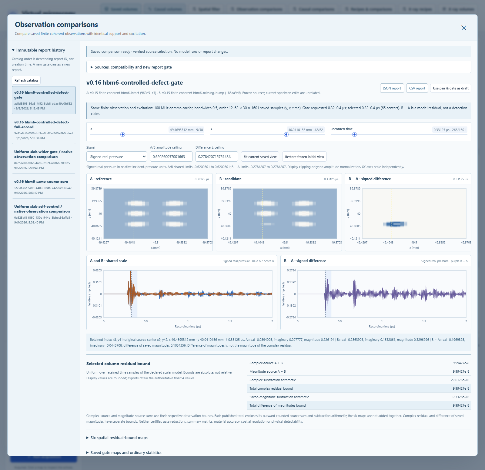

# Comparing saved finite coherent observations

Version 0.16 adds **Observation comparisons** to the workbench toolbar and a
comparison action in the saved finite coherent observation workspace. Select
completed observations as A and B, choose a recording-time gate, and create an
immutable report. A is your selected baseline; it is not measured ground truth.
No acquisition or new filtered volume is created.



## Workflow

1. Open **Observation comparisons**, or stage a saved observation as A from the
   finite coherent filter workspace.
2. Select B, review the inherited excitation and observation settings, and enter
   a gate within the actual saved recording centers. Optional initial X/Y/time
   indices determine the view retained in the report.
3. Create the report. Inspect A and B on shared scales and signed B−A on a
   symmetric scale. Select real pressure, imaginary quadrature or the difference
   of separately saved magnitudes. Move linked maps and traces using the saved
   coordinates; the cursor also reports the original source raster indices.
4. Inspect six full-record spatial bound maps, selected-column bounds, peak
   magnitude/RMS-real gate maps, and full-record/gated summary metrics. Display
   scales do not alter the data. A changed gate creates a new report.
5. Export JSON or lossless CSV, reopen report history, or use the source Zarr ZIP
   links to inspect the original typed observation arrays.

The saved report, its initial linked view and both report exports can be read
without either observation dataset or its original causal source arrays. Moving
to a new cursor requires both observations with exactly matching saved manifests
and typed data. Report history never recomputes a forward model.

## Compatibility

The only policy is `same_observation_and_excitation_v1`. Both inputs must be
completed `sam_coherent_observation_volume` datasets under the supported v0.15
finite operator and numerical contracts. The existing primary-echo, independent
causal, X-ray, recipe and depth-conversion kind guards remain unchanged.

Compatibility requires exact float64 X/Y/time bytes and lengths, array axes,
units and normalization; retained and source extents; source index mappings;
full surrounding support coordinates and physical neighbor offsets; and the
operator, weights, denominator, weight bytes/order, phase and magnitude semantics.
Equal retained centers alone are insufficient. Frozen nested causal provenance
must agree on excitation, recording-time reference, carrier, bandwidth, gamma
order, standoff and exterior media. Missing or unsupported contracts are rejected.

Different twins, defects and represented finite-layer properties are allowed and
disclosed. Numerical tolerance, precision and implementation differences are also
recorded. Descriptive hashes do not prove a physical cause. The comparison does
not interpolate, resample, register, align peaks, rotate phase, fit amplitudes,
normalize gain or select a matching subset automatically.

## Six numerical bound maps

Let `up` return a finite float64 value enclosing an exact nonnegative rational
from above. Every operand below is the exact value represented by its stored
float64 number. `fl` denotes the admitted binary64 subtraction operation.

The saved residuals are `fl(B.rf − A.rf)`, `fl(B.imaginary − A.imaginary)` and
`fl(B.envelope − A.envelope)`. The third subtracts two already recomputed
magnitudes; it is different from the magnitude of the complex residual.

For each retained X/Y column, over the **entire recording**:

```
complex_source_sum   = up(A.complex_total + B.complex_total)
magnitude_source_sum = up(A.magnitude_total + B.magnitude_total)

rho_j = 2^-53 * (max_time(abs(A_j)) + max_time(abs(B_j))) + 2^-1074
complex_arithmetic   = up(rho_rf + rho_imaginary)
magnitude_arithmetic = up(rho_envelope)

complex_total   = up(published complex_source_sum + published complex_arithmetic)
magnitude_total = up(published magnitude_source_sum + published magnitude_arithmetic)
```

The source errors may be correlated; there is no root-sum-square independence
assumption. The source bound maps are distinct and are not added together.
The arithmetic adapter reuses the unchanged causal comparison subtraction
allowances with zero source error, then composes only the required complex and
magnitude totals using exact rational arithmetic. This avoids an unrelated
intermediate overflow. Nonfinite data, residuals or unrepresentable bounds fail.
Existing subtraction-environment probes run before and after numerical work;
the code does not change the floating-point environment.

Bias, MAE, RMS difference, relative L2, maximum locators, peak/RMS gate products
and the diagnostic magnitude of a complex residual are ordinary floating-point
diagnostics without new enclosures. Zero-reference relative quantities retain a
null result and explicit reason. Inclusive gate endpoints select actual saved
time centers. Deterministic maximum locators prefer the first `[y,x,time]` index.

## Storage and resource admission

Reports have kind `sam_observation_comparison` and live in the separate
`observation-comparisons` directory. A content-addressed `source_snapshots` table
contains each complete observation manifest once. `source_reference` and
`source_candidate` reference its digest using lightweight summaries. Self
comparisons deduplicate the identical source. Each original nested causal
manifest remains complete within its one observation snapshot; no fields are
removed while claiming an unchanged hash.

Source manifests retain 16 MiB serialized / 64 MiB expanded limits. Reports are
capped at 64 MiB serialized / 192 MiB expanded, with a conservative 512 MiB
owned-workspace limit across verification, reduction, provenance, serialization
and response buffers. These are admission ceilings, not a prediction of process
RSS. Oversized self-contained reports are rejected. The comparison streams one
row per source and admits at most three million complex sample positions.

The source reader verifies canonical chunk/array metadata, fresh typed byte
hashes, saved bound composition and manifest identities. Rows are checked again
while reducing; source manifests are rechecked before publication. Immutable
report publication uses an exclusive atomic link and cannot overwrite a report.
The complete frozen report has its own content, request, source and implementation
identities. JSON decoding is bounded before parsing; linked paths, duplicate
keys, unsupported structures and nonfinite values fail closed.

The v0.15 historical verifier cannot reconstruct the original weighted-sum
component conversion maxima without the parent waveforms. Those maxima were
established at observation publication, then retained with immutable checksums.
This comparison carries that limitation forward. Numerical enclosures concern
the specified discrete scalar model and represented inputs; they do not establish
physical beam shape, spatial resolution, dimensional calibration, material
accuracy or defect-detection performance.

## API

`POST /api/v2/observation-comparisons` takes `reference_dataset_id`,
`candidate_dataset_id`, `gate_start_us`, `gate_end_us`, optional `name`, optional
initial `x_index`, `y_index`, `time_index`, and the fixed policy. It returns 201
with the complete immutable report. X/Y indices are bounded to 0–61 and validated
against the actual shape; time indices are bounded to 0–2048.

`GET /api/v2/observation-comparisons?limit=50&offset=0` lists lightweight reports
in descending canonical ID order. Limits are 1–100 with a 10,000-entry catalog
ceiling. ID order is stable, not chronological. `GET /{id}`, `GET /{id}/view`
without indices, and `GET /{id}/export?format=json|csv` are source-independent.
Explicit indices on `/view` request a fresh source-backed cursor. CSV uses
`section,field,value_json` with one complete JSON value per top-level report
field, retaining all numerical arrays and nested provenance losslessly.

Incompatible sources return 422 with `{message,issues}`; other invalid requests
return 422, missing reports or required sources 404, and storage failures 507.

See [the verification record](VERIFICATION.md) for the delivered HBM controls,
native browser checks and test results, and [the expansion plan](EXPANSION_PLAN.md)
for subsequent propagation, calibration and multiphysics work.
