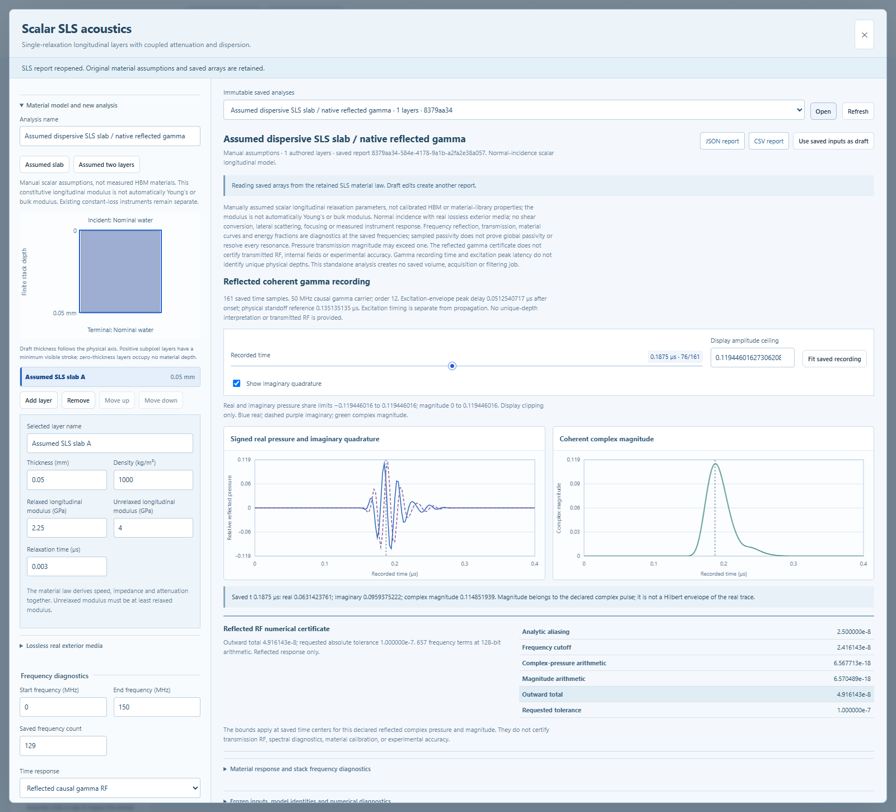

# Scalar relaxation material instrument

Version 0.17 adds **SLS materials** as a separate standalone instrument. Author
up to eight finite layers, inspect their frequency-dependent material response,
and save a reflected causal gamma waveform with a numerical error bound. The
parameters and example fixtures are explicit assumptions. They are not measured
HBM properties or an automatic conversion of the existing material library.



## Author and inspect a stack

1. Open **SLS materials**. Choose an assumed slab or two-layer fixture, then edit
   the stack. Layers are ordered from the incident side to the terminal side.
2. Set each layer's thickness in mm, density in kg/m³, relaxed and unrelaxed
   **longitudinal** modulus in GPa, and relaxation time in µs. The unrelaxed
   modulus must be at least the relaxed modulus. The total finite thickness is
   at most 6 mm. Zero-thickness layers contribute no scattering; their authored
   material curves remain inspectable.
3. Set the two real, lossless exterior media. Their impedance is in MRayl and
   sound speed in m/s. Incident speed controls the optional standoff delay.
   Terminal speed is retained read-only metadata; the terminal boundary response
   uses its impedance. Finite-layer speed and impedance are derived from its
   density and constitutive modulus, rather than independently entered.
4. Select the frequency range and sample count. Optionally enable reflected
   causal gamma RF, with carrier, amplitude-spectrum fractional FWHM, gamma
   order, recording start/duration/sample rate, standoff, tolerance and arithmetic
   precision. Frequency-only reports do not contain an RF certificate.
5. Estimate resource requirements, then save the report. Inspect pressure
   reflection/transmission magnitude and phase, energy fractions, layer
   attenuation, phase speed and complex impedance. RF retains real pressure,
   imaginary quadrature, magnitude and its actual time centers.
6. Reopen immutable history or export JSON/CSV. Display changes do not create a
   new report. A changed physical stack or recording requires a new calculation.

The gamma pulse is causal and has an onset-to-peak delay. Its fractional bandwidth
is the full width at half maximum of the complex amplitude spectrum divided by
the carrier. Standoff contributes a lossless round-trip delay at a nonreflecting
receiver. Recording time is not a unique reflector depth when there are repeated
returns. A smaller time step does not establish experimental spatial resolution.

## Material law and units

For rest initial conditions and the Laplace convention `exp(-s t)`, each finite
layer uses a scalar standard linear solid, also called the Zener model:

```
M(s) = M0 + (Minf - M0) s tau / (1 + s tau)
Z(s) = sqrt(rho M(s))
gamma(s) = rho s / Z(s)
propagation over d = exp(-gamma(s) d)
```

`M` is the effective scalar longitudinal constitutive modulus, not automatically
Young's modulus or a three-dimensional bulk modulus. The square-root branch is
analytic and positive for positive real `s`. Relaxed/unrelaxed equality removes
the relaxation term exactly, making the response independent of `tau`. All
displayed-unit input values are treated as their exact represented binary64
values; conversion to SI and subsequent certified arithmetic are enclosed.

The computed attenuation and phase speed are consequences of the same material
law. Attenuation is not an extra adjustable dB/mm multiplier. The existing
constant-loss-plus-delay instrument remains a separate causal model with its
original saved-data identity. See the [material and reflection proof](SLS_MATERIAL_PROOF.md)
for the constitutive equation, exterior-port flux argument, branch and analytic
continuation, and the hypotheses needed for the time-domain bound.

## Meaning of the outputs

Reflection is the pressure ratio at the incident face; transmission is the
pressure ratio at the terminal face. These frequency curves exclude standoff.
For real exterior impedances, energy diagnostics use `|R|²` and
`(Zi/Zt)|T|²`. **Pressure transmission can exceed one.** Absorptance is retained
without clipping, including small negative roundoff residuals. Wrapped phase is
undefined below the disclosed magnitude threshold. Discrete frequency curves,
energy fractions and material plots have no published total-error certificate;
they do not guarantee that every narrow resonance has been sampled.

The optional RF certificate applies to reflected complex pressure and its
magnitude at the saved time centers, under the exact represented scalar model.
It includes analytic future-alias and omitted-frequency bounds, Arb arithmetic,
and conversion to the actual returned doubles. The saved total conservatively
encloses the sum of its separately published components. The computation rejects
unresolved branches or denominators, unmet tolerances and excess work. It does
not silently reduce requested layers, recording samples or precision.

The certificate excludes uncertainty in material properties, geometry, instrument
response and measurements. It does not cover transmitted RF, internal fields,
shear/mode conversion, focused beams, lateral wave propagation or physical defect
detectability. No SAM raster, filter job, X-ray dataset or HBM geometry is changed
by a standalone SLS report.

## Persistence and reproducibility

Reports have the separate `sls_layered_analysis` kind and `sls-reports` directory.
They retain the validated original request, represented stack, spectrum, optional
reflected RF, numerical contracts, input and kernel identities, resource estimate
and declared assumptions. Publication is exclusive and atomic. The report store
checks bounded serialized/expanded content and certificate composition before
accepting a report. Historical reading, listing and exports do not synthesize a
waveform or import the current material/time kernels.

The API is under `/api/v2/sls-acoustics`: `POST /estimate`, `POST /reports`,
`GET /reports`, `GET /reports/{id}`, and `GET /reports/{id}/export?format=json|csv`.
Unsupported source-column conversion, redundant finite-layer speed/impedance,
old Gaussian settings and nonfinite or extra fields are rejected.

Independent checks include a pressure/velocity matrix-exponential transfer
calculation and an accelerated de Hoog inverse with separately inverted real and
quadrature transforms. The developer oracle in
[`tools/sls_independent_oracle.py`](../tools/sls_independent_oracle.py) imports no
production material, pulse, scattering or inversion helpers. Its degree
convergence is numerical agreement, not an independently certified remainder.
The [mpmath documentation](https://mpmath.org/doc/current/calculus/inverselaplace.html)
describes that algorithm and its real-valued inversion contract. Release-specific
test counts, actual reports and native evidence are in [VERIFICATION.md](VERIFICATION.md).
