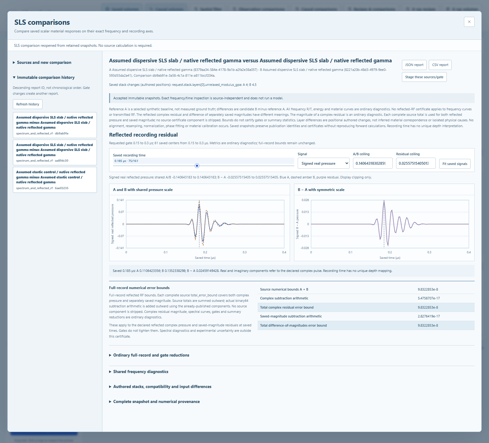

# Comparing saved scalar SLS material responses

Version 0.18 adds **SLS comparisons** beside **SLS materials**. Select a saved
reference A and candidate B to inspect their frequency responses and optional
reflected acoustic waveforms. A reference is a chosen baseline. Both sources
remain simulations of explicitly assumed materials, not measured ground truth.



## Workflow and compatibility

Open the comparison workspace from the toolbar or a saved material report. Choose
two complete source reports, then either frequency diagnostics alone or frequency
diagnostics with reflected RF. Review compatibility and parameter differences
before saving. In RF mode an optional inclusive time gate selects existing sample
centers. Saving creates an immutable comparison; changing a display cursor does
not run another simulation. Changing a gate requires a new comparison.

The sources must retain the same exact represented frequency centers, exterior
impedances and speeds, pressure normalization, phase and reference-plane meanings,
and supported material and numerical identities. RF additionally requires the
same saved time centers, excitation, recording definition and standoff. Different
precision and requested tolerance are disclosed and may be compared. Frequency
mode explicitly discloses unused pulse differences and contains no RF product.
An incompatible pair is rejected without resampling, alignment, gain fitting or
automatic selection of a common window.

Finite-layer count, order, names, thickness, density, longitudinal moduli and
relaxation times can differ. The display retains independently identified A and B
layers. Positional field differences describe changes in the saved requests;
matching positions or names do not establish material correspondence. Selecting
two material curves for visual comparison does not attribute a response change
to one layer when other inputs also changed.

## What the curves mean

Frequency plots retain the original complex reflection and transmission,
magnitudes, energy fractions and independently labeled material curves. Residuals
are signed candidate B minus reference A. Wrapped phase is inspected separately;
its subtraction is not interpreted as an unwrapped phase shift or delay.
Pressure transmission can exceed one. Frequency curves and their reductions are
ordinary numerical diagnostics without a published RF error bound.

RF inspection links the exact saved times across real pressure, imaginary
quadrature and magnitude. A/B plots share scales, and residual plots use symmetric
limits. **Saved magnitude difference** means `|B| - |A|` using the two stored
magnitude arrays. **Complex residual magnitude** means `|B - A|` and is a separate
ordinary diagnostic. Their meanings and values generally differ.

Gate statistics select actual centers inclusively. They retain requested times,
selected indices and actual selected endpoints. Bias, MAE, RMS, relative L2, peak
locators are ordinary diagnostics; undefined ratios retain
an explicit reason. A gate does not improve a full-record numerical bound.

## Numerical bound for reflected residuals

Each source's published `total_error_bound` bounds its reflected complex pressure
and separately saved magnitude under the exact represented scalar model. Use the
entire source total, including all of its components. Let these bounds be `epsA`
and `epsB`. The triangle inequality bounds the difference of the two model errors
by their sum; no independence of errors is assumed.

For stored component `j`, define `rho_j` using exact rationals of saved binary64
values, binary64 unit roundoff `u = 2^-53`, and `eta = 2^-1074`:

```
rho_j = u * (max_t |A_j(t)| + max_t |B_j(t)|) + eta
source_sum = up(epsA + epsB)
complex_arithmetic = up(rho_real + rho_imaginary)
magnitude_arithmetic = up(rho_saved_magnitude)
complex_total = up(exact(source_sum) + exact(complex_arithmetic))
magnitude_total = up(exact(source_sum) + exact(magnitude_arithmetic))
```

`up` is the smallest finite binary64 number enclosing its exact nonnegative
argument. The component subtraction error bound includes gradual underflow. The
sum of real and imaginary allowances conservatively bounds the complex error.
The two totals enclose their already published components, avoiding inward
rounding during composition. All five bounds apply across the full saved record,
including when displayed metrics use a narrower gate. Self-comparisons have zero
stored residuals and still retain conservative positive source bounds.

The implementation reuses the existing verified binary64 subtraction path with
entry and exit tests of actual operations, including rounding ties and subnormal
values. It rejects unsupported arithmetic, nonfinite inputs and overflow. These
checks do not change the floating-point environment. The numerical contract is
limited to the supported CPython/NumPy 2 little-endian Windows/Linux x86-64 path.

Let `yA` and `yB` be the two ideal declared-model responses, `d_saved` the
stored complex subtraction, and `dm_saved` the stored magnitude subtraction.
At each saved center the contract is:

```
|d_saved - (yB - yA)| <= complex_total
|dm_saved - (|yB| - |yA|)| <= magnitude_total
```

These bound the numerical error of the residual, not its physical amplitude.
They do not cover measured material uncertainty, geometry uncertainty, transmitted RF,
physical defect detectability, or statistical and spectral reductions. Source
integrity checks retain a recorded certificate; they do not independently repeat
the source inversion or prove experimental validity.

## Saved evidence and resource limits

The new `sls_analysis_comparison` kind is separate from acoustic acquisitions,
previous comparison kinds and the source `sls_layered_analysis` reports. Each
complete source report appears once in a digest-keyed snapshot table. Roles refer
to those snapshots; a self-comparison stores one snapshot. Original requests,
arrays, source certificates, runtime details, proof identity and nested hashes
remain intact. Residual arrays are stored once, without duplicating source
waveforms into each view.

Historical reading, linked cursors and JSON/CSV exports use the verified snapshots
even when the original source files are unavailable. Reading does not load the
current material kernel or recreate a waveform. New comparison publication still
requires accessible, verified originals. Publication is exclusive and atomic;
existing reports are never overwritten.

Admission limits are 8,193 frequency centers, 2,049 time centers, 32 MiB serialized
comparison content, 128 MiB expanded content and 512 MiB owned workspace.
Combined input, retained source, validation, snapshot, residual, encoding and
response storage must fit the workspace before publication. These are ceilings,
not a promise that every simultaneous maximum will fit, and not total process
RSS. Oversized or incompatible content is rejected rather than truncated.

See [scalar materials](SLS_ACOUSTICS.md), the [source model proof](SLS_MATERIAL_PROOF.md)
and [release verification](VERIFICATION.md) for the source computation and actual
verification scope. The delivery controls are a self-comparison, an elastic
pair changing only inactive relaxation time, and a dispersive pair changing only
unrelaxed longitudinal modulus. They test numerical behavior, not calibration.
