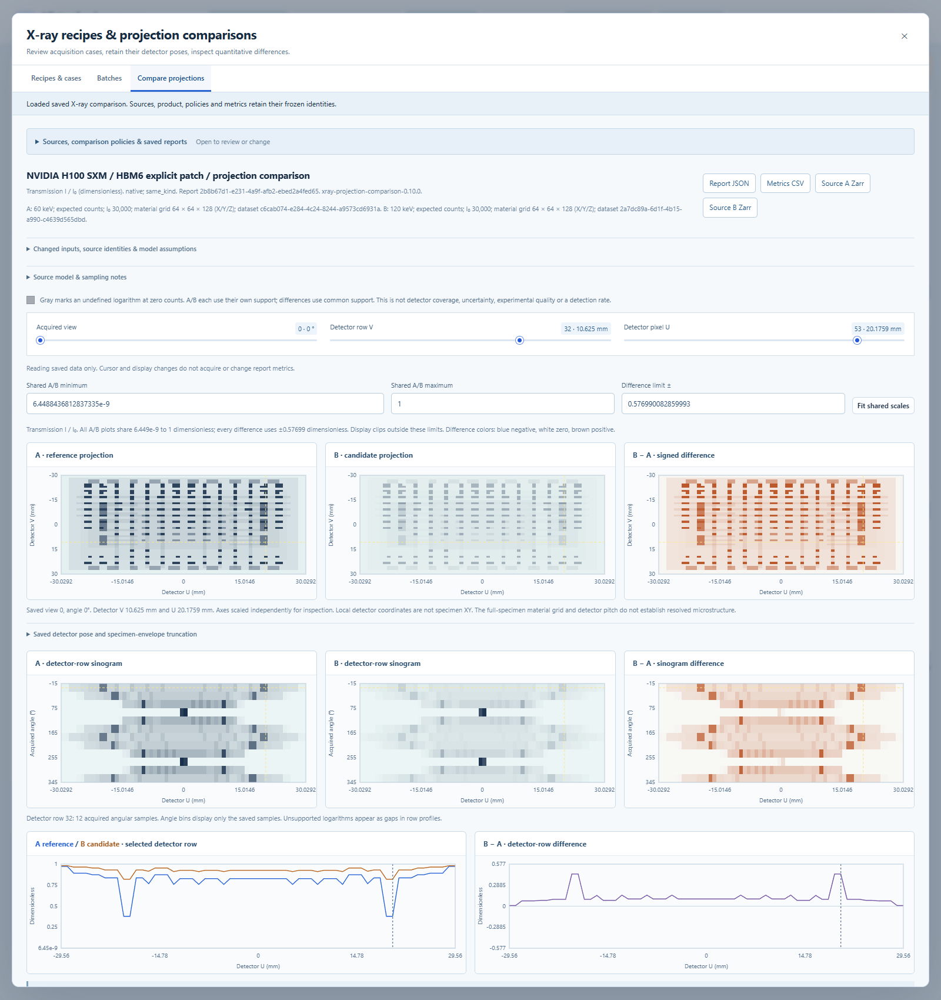

# X-ray recipes and saved projection comparisons — version 0.10

The X-ray workspace saves complete acquisition recipes, runs reviewed two-to-four-case batches, and compares retained projection volumes. The CPU parallel-beam forward model is unchanged. These are synthetic numerical experiments; a chosen reference acquisition is not experimental truth.

## Use the workspace

Open **X-ray recipes** in the workbench to enter the recipes and comparisons workspace, or enter it from a saved X-ray recording. A recipe captures the current twin and all source, material-grid, detector, angle, pose, blur, noise, seed and defect settings. Save an immutable revision to change a recipe. Import/export uses the complete original JSON, including numeric spelling needed by its checksum. Loading a recipe never acquires data.

Choose one active case variable and two to four distinct values. Supported variables are energy, incident photons, detector FWHM, material grid X/Y/Z, noise, seed, all-defect participation, or one selected authored HBM defect. A local defect pair preserves the other defects, all six HBM sites and the geometry precedence. Detector dimensions, angles, offsets and rotation center can be edited in a recipe, but are not offered as comparison sweeps because this release requires exactly matching measurement coordinates.

Review the exact setting and primitive changes, output/work estimates, and frozen case requests before running the batch. Every case is validated and staged before one transaction publishes the work. The existing single worker runs cases in order and reports X-ray progress in views. Cancel/resume through the batch controls; completed cases remain intact. Historical SAM recipes, untagged SAM requests, plans, hashes and staging journals retain their original interpretation.

## Select a defensible comparison

Select completed reference A and candidate B recordings, a product and explicit policies. The difference is always **B minus A**.

| Product | Metric support | Photon and observation policy |
| --- | --- | --- |
| Counts | Every detector pixel, including zero counts | Same incident photons and same observed/expected kind; native comparison only |
| Transmission | Every pixel, including zeros; values above one are retained | Native requires equal photons; unequal photons require explicit `per_source_incident` |
| Line integrals | Intersection of positive-count masks; half-count placeholders excluded | Same normalization rules as transmission; negative log values are retained |

For transmission or logarithms, comparing a noisy observation with noise-free expected values additionally requires `observed_vs_expected`. Selecting per-source incident normalization means using each saved normalized product and its frozen photon count; it does not fit amplitudes, rescale raw counts or cancel counting noise. Equal seeds under different intensities do not make the two observations independent or cancel their noise.

The sources must have identical `[view,v,u]` shape and exactly equal float64 angles, detector coordinates, ray directions, detector centers and U/V basis vectors. One-ULP differences are reported. The tool does not reorder views, equate opposed projections, treat angles modulo 360 degrees, register images or interpolate coordinates.

Projection maps, detector-row profiles and sinograms share A/B scales. Differences use a scale symmetric about zero. Selecting a location links the view, row and detector column; the largest supported residual has a signed numerical locator. Unsupported log samples are null/masked, distinct from an actual measured zero. The positive-count mask indicates logarithm support, not specimen coverage, detector quality or defect confidence. Truncation is reported separately.

## Frozen results and provenance

Reports contain float64 streamed bias, MAE, RMSE, relative L2, maximum absolute difference and its signed location. Global and per-view support counts distinguish total pixels, A-valid, B-valid, common, A-only, B-only and neither. Relative L2 is null with a reason for a zero reference norm or empty support. All products are checked for nonfinite values, including values outside common log support.

Each report freezes both source manifests, their input/material/solver identities, exact coordinates, request policies, formulas, processing fingerprints, package versions, metrics, support and the initially selected plots. JSON and CSV exports remain readable without the source datasets. Selecting a new view requires unchanged, verified sources. Read/view/export operations never reacquire data or overwrite source files. A different product or policy produces a new report.

Limits remain four cases and 2 GiB aggregate batch output, with each acquisition capped at 512 MiB output, 512 MiB estimated numerical workspace, 64 million material cells and 250 million projection-work units. Comparison processing is capped at 512 MiB estimated workspace with one view per source in the reduction. Canonical product and coordinate chunks, bounded source/report JSON, expanded JSON accounting and frozen checksums guard reads. These estimates describe numerical/serialization allocations, not total process RSS.

## Physical interpretation

This release still uses monochromatic attenuation, a voxelized material field, a parallel-beam projector, Gaussian detector blur and optional Poisson sampling. A finer detector pitch cannot restore a feature omitted by the material grid. The H100 example has six modeled HBM sites and explicit local bumps/TSVs; a coarse full-package projection is not evidence that those micrometer features are resolved. The supplied reference image's approximately 4.6 µm pixel size remains provisional and is not an experimentally established resolution.

See [the specification and acceptance scope](XRAY_COMPARISONS_SPEC.md), [verification evidence](VERIFICATION.md), [projection volume details](XRAY_VOLUMES.md) and [the expansion roadmap](EXPANSION_PLAN.md).
